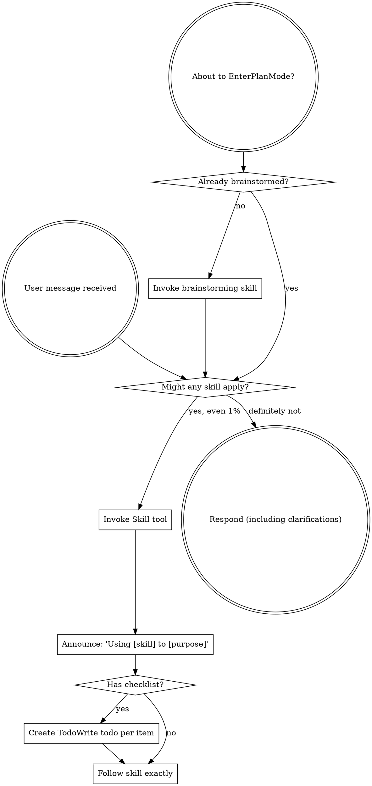

## k-Coder 本地适配

本节替代下文其他客户端的工具名、配置目录和交付流程；方法论与质量要求继续适用。系统、开发者及用户/项目指令优先于 Skill；Skill 不授予工具权限。用户已经明确要求实现时直接执行，不因本技能重复请求实施确认；默认不提交、不推送。生成说明、计划和报告放在项目 docs/ 下。

- 加载本插件其他技能：plugin_skill_read({"pluginId":"superpowers@local","skillName":"<名称>"})。不要调用不存在的 Skill、activate_skill 或 skills.list。
- 读取参考资源：plugin_resource_read({"pluginId":"superpowers@local","path":"skills/<技能目录>/<相对资源路径>"})；路径来自实际目录，不猜测。
- 文件：read_file、list_directory、search_repository、apply_patch、write_file；参数路径必须相对当前工作区，不能使用绝对路径或 ..。Shell 使用 run_command，遵守其公开 Schema、审批、超时和取消。
- 可见计划：update_plan({"steps":[{"step":"检查与实现","status":"in_progress"},{"step":"验证","status":"pending"}]})。最多一个 in_progress。
- 委派（仅当当前工具目录存在且任务允许时）：create_agent({"task":"明确子任务","label":"review","forkTurns":"none"})；后续使用 wait_agent、send_agent_message、resume_agent、list_agents、close_agent，参数以当前 Schema 为准。不要调用 spawn_agent/Task，不指定不存在的 model 字段，不创建第二套智能体循环；工具不可用时在主任务顺序完成。
- 本宿主没有 Codex 模式切换、App 手交和 Codex 专用配置工具；不要修改 ~/.codex。隔离与 Git 操作遵守当前项目边界；已有授权不重复询问，提交/推送须由用户明确要求。

<SUBAGENT-STOP>
If you were dispatched as a subagent to execute a specific task, skip this skill.
</SUBAGENT-STOP>

<EXTREMELY-IMPORTANT>
If you think there is even a 1% chance a skill might apply to what you are doing, you ABSOLUTELY MUST invoke the skill.

IF A SKILL APPLIES TO YOUR TASK, YOU DO NOT HAVE A CHOICE. YOU MUST USE IT.

This is not negotiable. This is not optional. You cannot rationalize your way out of this.
</EXTREMELY-IMPORTANT>

## Instruction Priority

Skills are task guidance. System and developer instructions, user requests and applicable project rules take precedence; Skills never grant tool permissions.

## How to Access Skills

**In Claude Code:** Use the `Skill` tool. When you invoke a skill, its content is loaded and presented to you—follow it directly. Never use the Read tool on skill files.

**In Copilot CLI:** Use the `skill` tool. Skills are auto-discovered from installed plugins. The `skill` tool works the same as Claude Code's `Skill` tool.

**In Gemini CLI:** Skills activate via the `activate_skill` tool. Gemini loads skill metadata at session start and activates the full content on demand.

**In other environments:** Check your platform's documentation for how skills are loaded.

## Platform Adaptation

Skills use Claude Code tool names. Non-CC platforms: see `references/copilot-tools.md` (Copilot CLI), `references/codex-tools.md` (Codex) for tool equivalents. Gemini CLI users get the tool mapping loaded automatically via GEMINI.md.

# Using Skills

## The Rule

**Invoke relevant or requested skills BEFORE any response or action.** Even a 1% chance a skill might apply means that you should invoke the skill to check. If an invoked skill turns out to be wrong for the situation, you don't need to use it.

## Red Flags

These thoughts mean STOP—you're rationalizing:

| Thought | Reality |
|---------|---------|
| "This is just a simple question" | Questions are tasks. Check for skills. |
| "I need more context first" | Skill check comes BEFORE clarifying questions. |
| "Let me explore the codebase first" | Skills tell you HOW to explore. Check first. |
| "I can check git/files quickly" | Files lack conversation context. Check for skills. |
| "Let me gather information first" | Skills tell you HOW to gather information. |
| "This doesn't need a formal skill" | If a skill exists, use it. |
| "I remember this skill" | Skills evolve. Read current version. |
| "This doesn't count as a task" | Action = task. Check for skills. |
| "The skill is overkill" | Simple things become complex. Use it. |
| "I'll just do this one thing first" | Check BEFORE doing anything. |
| "This feels productive" | Undisciplined action wastes time. Skills prevent this. |
| "I know what that means" | Knowing the concept ≠ using the skill. Invoke it. |

## Skill Priority

When multiple skills could apply, use this order:

1. **Process skills first** (brainstorming, debugging) - these determine HOW to approach the task
2. **Implementation skills second** (frontend-design, mcp-builder) - these guide execution

"Let's build X" → brainstorming first, then implementation skills.
"Fix this bug" → debugging first, then domain-specific skills.

## Skill Types

**Rigid** (TDD, debugging): Follow exactly. Don't adapt away discipline.

**Flexible** (patterns): Adapt principles to context.

The skill itself tells you which.

## User Instructions

Instructions say WHAT, not HOW. "Add X" or "Fix Y" doesn't mean skip workflows.
