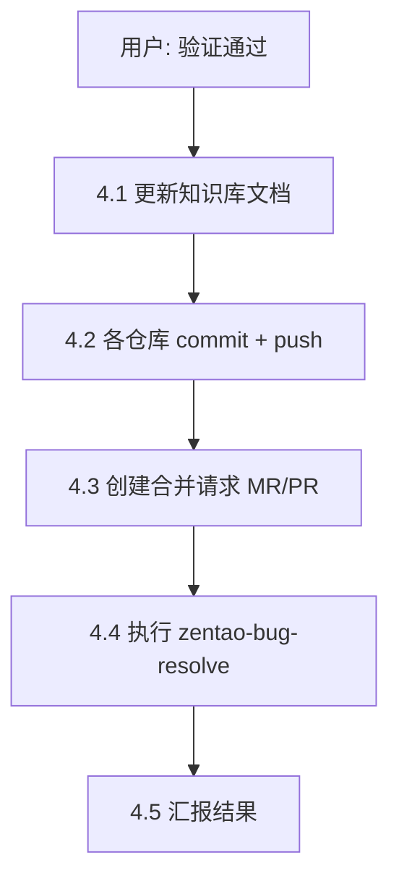

# 阶段四：验证通过后的收尾（自动执行）

**门禁**：用户明确回复 **「验证通过」**（或同义：「可以了」「联调 OK」「验证 OK」）。

本阶段在 `zentao-bug-fix` 流程内**自动串联**执行，无需用户再次说「提交」「推送」「建 MR」「标记已解决」。

## 流程总览



## 4.1 更新知识库文档

在处理文档 `zentao-bug-{id}-*.md` 中更新：

| 字段 | 值 |
|------|-----|
| 状态 | **已解决** |
| 验证人 | 当前用户（若可知） |
| 验证时间 | 当天日期 |
| 修复记录 | 补充验证结论、commit hash、MR 链接 |

若文档仍为「已修复待验证」，先确认用户确实完成联调再改状态。

## 4.2 Git 提交并推送

对文档「目标仓库」及「关联仓库」中**有未提交改动**的每个仓库依次执行。

### 前置检查（每个仓库）

```powershell
cd D:\ProjectCode\{repo}
git status
git branch --show-current
git remote -v
```

### 提交规则

- **只 add 与本 Bug 相关的文件**（代码；知识库见下），禁止 `git add .` 夹带无关改动
- **IbpmGAA**：新增知识库写 `D:\1.CursorProject\文档\IbpmGAA\lessons\`，**不得** `git add docs/lessons/`；远端已有 lessons 文件保留，禁止 `git rm` 或改写历史删除
- **其他仓库**：知识库路径一般为 `docs/lessons/zentao-bugs/zentao-bug-{id}-*.md`，可随代码一并提交
- **保持文件原有编码**（GB2312 / UTF-8 BOM 等）
- **commit message**：

```
fix: 禅道 #{id} {简短标题}

- 验证：已通过
```

（非 IbpmGAA 仓库可在 message 中注明知识库路径）

### 推送

```powershell
git push -u origin HEAD
```

- 当前不在功能分支时：创建 `feature/zentao-{id}-{slug}` 或沿用既有功能分支（与团队约定一致）
- push 失败时：汇报错误，**不继续** MR 与禅道 resolve，待用户处理

## 4.3 创建合并请求（MR / PR）

每个已 push 的仓库创建一条合并请求，目标分支为仓库默认分支（`main` / `master` / `develop`，以 `git symbolic-ref refs/remotes/origin/HEAD` 或团队约定为准）。

### 华为云 CodeHub（常见）

远程形如 `codehub.devcloud.huaweicloud.com`：

1. 优先尝试 **glab**（若已安装且已配置）：

```powershell
glab mr create --title "fix: 禅道 #{id} {简短标题}" --description "## Summary`n- Bug: #{id}`n- 文档: docs/lessons/zentao-bugs/...`n`n## Test plan`n- [x] 联调验证通过"
```

2. 若无 glab：push 后给出 CodeHub 创建 MR 的直达链接模板，并提示用户在 Web 上补建 MR。

### GitHub

按用户规则使用 `gh`：

```powershell
gh pr create --title "fix: 禅道 #{id} {简短标题}" --body "$(cat <<'EOF'
## Summary
- Bug #{id} 验证通过

## Test plan
- [x] 联调验证通过

EOF
)"
```

### 多仓库

| 场景 | 处理 |
|------|------|
| 单仓库 | 一条 MR |
| 多仓库（如 hr-api + IbpmGAA） | **每个仓库各一条 MR**，MR 链接写入知识库文档 |

## 4.4 执行 zentao-bug-resolve（必读技能）

**必须**读取并遵循技能 **`zentao-bug-resolve`**（`zentao-bug-resolve/SKILL.md`），执行禅道 **已解决**（`resolved`，默认不 close）。

**默认不传禅道评论**；修复详情已在知识库文档中记录。确需评论时仅一句 ASCII，如 `-Comment "verified"`。

### 执行脚本

```powershell
& "$env:USERPROFILE\.cursor\scripts\Set-ZentaoBugResolved.ps1" -BugId {id}
```

- 写接口必须用 **POST**（见 `zentao-bug-resolve/references/resolve-api.md`）
- 脚本退出码非 0 或 `Success=false` 时如实汇报，文档可标「禅道 resolve 失败待重试」

用户明确要求 **关闭** Bug 时，加 `-CloseAfterResolve`。

## 4.5 汇报模板

```
Bug #{id} 验证通过收尾完成

文档
- 状态：已解决
- 路径：{path}

Git
- {repo1}：{branch} @ {commit} → {mr_url}
- {repo2}：...

禅道
- 状态：active → resolved
- 链接：https://zentao.isscloud.com/bug-view-{id}.html
```

## 异常与回滚

| 情况 | 处理 |
|------|------|
| 无未提交改动 | 跳过 commit，仍可 push 已有 commit 并建 MR |
| push 403/认证失败 | 停止，提示用户配置 SSH/凭据 |
| MR 创建失败 | 保留 push 结果，汇报分支名，请用户 Web 补建 |
| 禅道 resolve 失败 | 代码与 MR 已完成也须汇报；文档备注待重试 |
| 多仓库仅部分成功 | 分别汇报成功/失败项 |

## 禁止事项

- 验证未通过时不得因用户随口说「验证通过」而执行本阶段（若上下文矛盾则二次确认）
- 不得 force push
- 不得将无关文件 commit 进本 Bug
