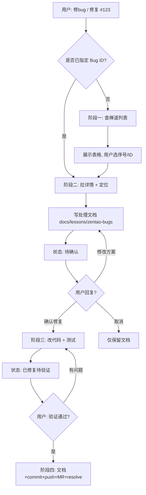

# zentao-bug-fix 处理工作流

> 禅道 Bug 修复技能：**文档先行 + 人工确认 + 最小改动**  
> 与 `zentao-bugs`（仅查询/通知）分离，本技能负责「分析 → 文档 → 确认 → 改代码」。

## 触发词

`修bug`、`修复禅道`、`处理bug`、`自动修bug`、`zentao bug fix`、`修复 #123`

纯查询 Bug 列表请用 **zentao-bugs**，勿触发本技能。

---

## 核心原则

| 原则 | 说明 |
|------|------|
| 先文档、后代码 | 未完成人工确认前，**禁止**修改业务代码、commit、push |
| 用户选择 | 必须展示 Bug 列表由用户选定，或用户直接给出 Bug ID |
| 知识库落盘 | 分析结果写入 `{目标仓库}/docs/lessons/zentao-bugs/` |
| 最小改动 | 确认后改代码时，遵循目标仓库 `AGENTS.md` / `CLAUDE.md` 规范 |
| 保持编码 | 修改文件时保持原文件编码（GB2312 / UTF-8 BOM 等） |

---

## 流程总览



---

## 文档状态机

```
待确认 → 修复中 → 已修复待验证 → 已解决
         ↑              ↓
         └── 验证有问题 ─┘
```

| 状态 | 含义 | 进入条件 |
|------|------|----------|
| 待确认 | 处理文档已生成，等待审阅 | 阶段二完成 |
| 修复中 | 用户已确认，正在改代码 | 用户回复「确认修复」等 |
| 已修复待验证 | 代码已改、测试已跑，待联调/页面验证 | 阶段三完成 |
| 已解决 | 验证通过，文档/commit/MR/禅道 resolve 完成 | 用户回复「验证通过」，阶段四完成 |

---

## 阶段一：查询列表并让用户选择

### 1.1 获取 Bug 列表

凭据与 API 见 [zentao-api.md](zentao-api.md)。规则与 `zentao-bugs` 一致：

- **默认**：我的 bug（`browseType=assigntome`，`assignedTo.account` = 当前用户）
- **团队**：用户指定时 `browseType=unresolved`，按 Bug `id` 去重
- 只保留 `status` = `active`

PowerShell 快捷脚本（可选）：

```powershell
& "$env:USERPROFILE\.cursor\scripts\Get-ZentaoBugListJson.ps1"
& "$env:USERPROFILE\.cursor\scripts\Get-ZentaoBugDetail.ps1" -BugId 12345
```

### 1.2 展示待选列表

按严重程度、优先级排序：

| 序号 | Bug ID | 标题 | 严重程度 | 优先级 | 产品 | 模块 |
|------|--------|------|----------|--------|------|------|
| 1 | 12345 | ... | 严重 | 高 | ... | ... |

### 1.3 等待用户选择

- 用户已给出 Bug ID（如「修复 #17077」）→ **跳过选择**，直接进入阶段二
- 否则用 **AskQuestion** 或请用户回复 **序号 / Bug ID**
- **未收到明确选择前，不得进入分析与写文档**

---

## 阶段二：拉取详情、定位、生成处理文档

### 2.1 获取 Bug 详情

```
GET /api.php/v1/bugs/{bugID}
```

提取：`title`、`steps`、`product`/`module`、`severity`、`pri`、`assignedTo`、`keywords` 等。

禅道链接：`https://zentao.isscloud.com/bug-view-{bugID}.html`

### 2.2 映射代码仓库

按 [repo-mapping.md](repo-mapping.md) 映射到 `D:\ProjectCode\{项目}`。

映射不确定时：**列出 2～3 个候选仓库让用户确认**。

### 2.3 检索知识库与代码

在目标仓库依次执行：

1. **已有经验**：`docs/lessons/`、`D:\1.CursorProject\文档\{项目名}\`
2. **代码定位**：SemanticSearch + Grep（标题、步骤、模块、接口、页面路径）
3. **相关规范**：`AGENTS.md`、`CLAUDE.md`、`.cursorrules`

记录：疑似文件、类/方法、数据表、调用链。

### 2.4 生成处理文档（必须）

模板见 [fix-document-template.md](fix-document-template.md)。

**输出路径**（按优先级）：

1. `{目标仓库}/docs/lessons/zentao-bugs/zentao-bug-{id}-{slug}.md`
2. 仓库未确定：`D:\1.CursorProject\文档\{项目名}\03-缺陷修复\zentao-bug-{id}-{slug}.md`

`slug`：标题取 2～4 个英文关键词，小写、`-` 连接。

文档状态：**`待确认`**。

### 2.5 向用户汇报（本阶段结束）

汇报内容包含：

- 文档完整路径
- Bug #{id} 标题
- 目标仓库
- 初步结论（一句话）
- 建议改动文件摘要

请用户回复：

| 回复 | 动作 |
|------|------|
| **确认修复** | 进入阶段三 |
| **修改方案** + 意见 | 更新文档后再次确认 |
| **取消** | 仅保留文档，不改代码 |

**本阶段禁止**：修改 `.cs`、`.ts`、`.ascx` 等业务源码（读取、搜索除外）。

---

## 阶段三：人工确认后改代码

**门禁**：仅当用户明确回复「确认修复」「开始改代码」「按方案执行」等肯定意图。

细则见 [code-fix-phase.md](code-fix-phase.md)。

### 步骤

1. 文档状态 → **`修复中`**
2. 按文档「建议改动」做**最小必要**代码修改
3. 跑目标仓库测试：`dotnet test`（或按 README）
4. 更新文档「修复记录」→ 状态 **`已修复待验证`**
5. 向用户展示 diff 与测试结论
6. **默认不自动 commit/push**（除非用户明确要求）

### 用户验证后

| 回复 | 动作 |
|------|------|
| **验证通过** | **自动进入阶段四**（见 [verify-passed-phase.md](verify-passed-phase.md)） |
| **有问题** | 说明现象，继续修复 |

阶段三结束时提示用户：联调完成后回复 **「验证通过」** 将自动完成提交、推送、建 MR 与禅道标记已解决。

### 禁止事项（除非用户明确要求）

- 自动 `git commit` / `git push`
- 修改生产数据库
- 跳过测试直接声称已修复
- 未经确认进入本阶段

---

## 阶段四：验证通过收尾（自动执行）

用户回复 **「验证通过」** 后，按 [verify-passed-phase.md](verify-passed-phase.md) **自动串联**执行：

| 步骤 | 内容 |
|------|------|
| 4.1 | 知识库文档 → **已解决** |
| 4.2 | 相关仓库 **commit + push** |
| 4.3 | **创建 MR/PR**（华为 CodeHub 优先 `glab mr create`，GitHub 用 `gh pr create`） |
| 4.4 | 执行 **`zentao-bug-resolve`**：`Set-ZentaoBugResolved.ps1`（POST resolve，验证 status） |
| 4.5 | 汇报文档、commit、MR、禅道链接 |

commit message：`fix: 禅道 #{id} {简短标题}`

多仓库（如 hr-api + IbpmGAA）各提交、各建 MR，链接写入知识库文档；禅道 resolve 默认不带评论。

---

## 异常处理

| 情况 | 处理 |
|------|------|
| 登录 401 | 检查 `zentao.config.json` 或环境变量 |
| Bug 列表为空 | 告知无待处理 Bug，结束 |
| 无法定位仓库 | 暂停，请用户指定项目名或路径 |
| 无法定位代码 | 文档标注「待人工定位」，列出已搜索关键词与候选文件 |
| 文档目录不存在 | 自动创建 `docs/lessons/zentao-bugs/` |

---

## 参考文件索引

| 文件 | 用途 |
|------|------|
| [SKILL.md](../SKILL.md) | 技能入口与阶段概要 |
| [workflow.md](workflow.md) | 本文件：完整处理工作流 |
| [zentao-api.md](zentao-api.md) | 登录、列表、详情、备注 API |
| [repo-mapping.md](repo-mapping.md) | 禅道产品 → 代码仓库 |
| [fix-document-template.md](fix-document-template.md) | 处理文档模板 |
| [code-fix-phase.md](code-fix-phase.md) | 阶段三改代码细则 |
| [verify-passed-phase.md](verify-passed-phase.md) | 阶段四：验证通过收尾 |
| [zentao-bug-resolve](../../zentao-bug-resolve/SKILL.md) | 禅道 resolve 细则 |

---

## 实例：Bug #17077

| 阶段 | 实际操作 |
|------|----------|
| 一 | 查出待处理 Bug 列表，用户选择 **#17077** |
| 二 | 生成 `zentao-bug-17077-emp-fullname-space.md`，确认规则：修改前全名 = `EI_RS_Name` = `EmpName` |
| 三 | 用户「确认修复」→ hr-api 补 `EmpName`、IbpmGAA 改 `PersonnelView.aspx`；用户要求后 commit/push |
| 四 | 文档更新为「已修复待验证」，禅道关单待联调验证后执行 |
