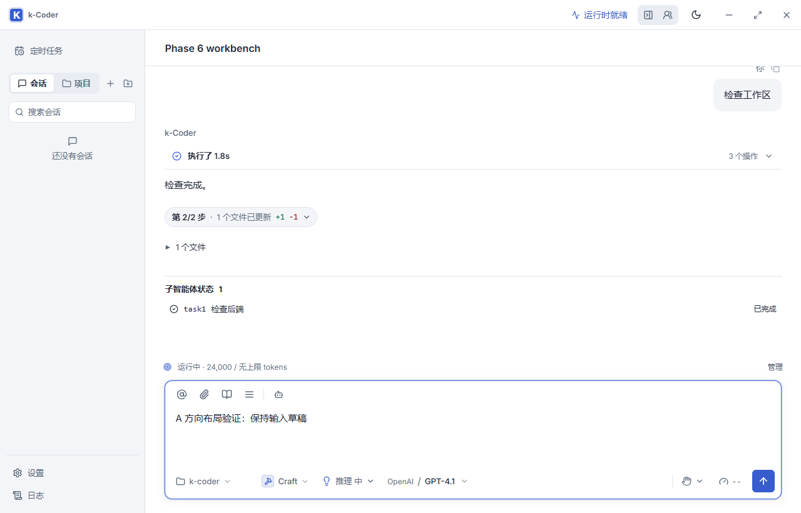
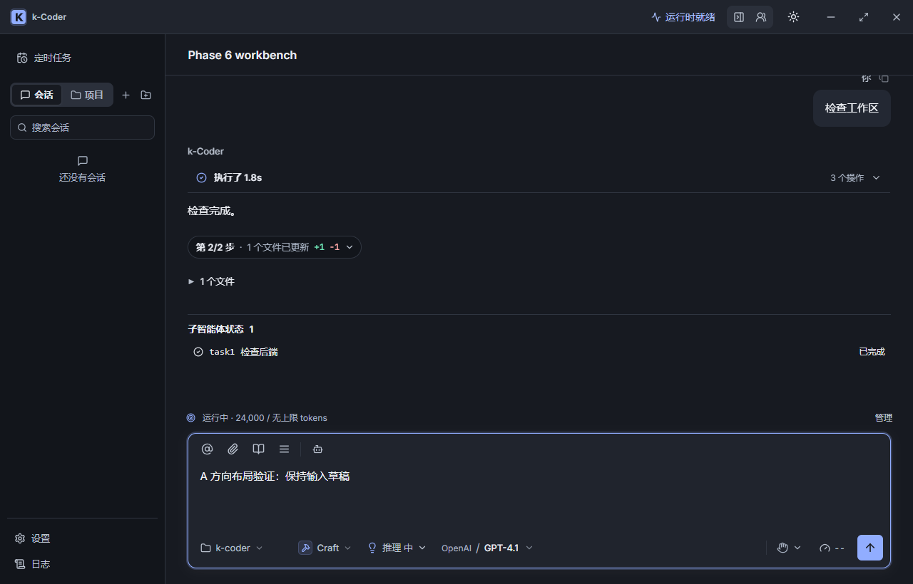

# UI A 方向优化验证

日期：2026-09-10。用户选择 A 方向，按“清晰、克制的专业工作台”实施。代码已落地，原生交互验收尚未完成；路线图 P10-170 保留进行中。改动停留在工作区，未提交或部署。

## 界面变化

- 默认浅色使用白色内容区、浅灰侧栏和蓝色操作色；深色使用中性灰层次，增强文字可读性。
- 导航与辅助文字主要使用 13px，正文及输入文字 15px；保留代码区域自身字号。
- 输入区统一为一个 12px 圆角容器，移除工具栏分割背景、重复内层光晕和聚焦位移。
- 统一侧栏行高、搜索框、会话/项目切换与选中态；保留长标题右侧操作按钮空间。
- 简化完成状态和变更详情的装饰，保留展开、失败和审批状态；面板拖动、模型选择和事件处理逻辑不变。
- 深色实心品牌按钮使用深色前景，实际按钮 normal/hover 文字对比度均有回归覆盖。

实现入口：`src/App.css`、`src/styles/workspace.css`、`src/main.tsx`、`src/lib/theme.ts`；测试在 `e2e/workbench.spec.ts`。工作区原有的图片功能和面板拖动等并行改动未回退。

## 自动验证

| 检查 | 结果 |
| --- | --- |
| `pnpm build` | 通过；保留现有产物 chunk 大小提示 |
| `cargo fmt --manifest-path src-tauri/Cargo.toml -- --check` | 通过 |
| `cargo check --manifest-path src-tauri/Cargo.toml` | 通过 |
| `cargo test --manifest-path src-tauri/Cargo.toml` | 530 通过，0 失败 |
| `git diff --check` | 通过；Git 提示部分文件行尾转换 |
| A 方向最终专项 | 12 通过，覆盖浅/深色字号、对比度、输入焦点稳定、375/853/1024/1280px 视口、面板拖动、紧凑状态、审批模式和机器人进度 |
| 主工作台流程复测 | desktop/narrow 2 通过 |
| 历史问题卡片复测 | desktop/narrow 2 通过 |

新增可读性测试最初因导航 11px 不满足 13px 而失败；深色主按钮测试最初测得对比度约 2.18:1，不满足 4.5:1。完成样式修复后均通过。独立只读复查指出的会话标题操作区、深色按钮前景和失败计划 hover 边框三项均已修复并再次复查。

全量 E2E 首轮 212 项：192 通过、8 跳过、12 失败。12 个失败为 6 个场景的双视口实例。其中主工作台旧字号断言、历史问题卡片旧深色色值断言已更新，4 个实例复测通过；主工作台中的旧 Skills 平铺断言也调整为显式展开已有分类。

剩余 4 个场景（8 个实例）未在本任务修改其功能或断言：欢迎页未出现、Skills `/r` 首候选已变成 `/requirements-intake`、记忆设置入口缺失、恢复历史没有 `.turn-execution`。使用任务开始时保存的 App.css 与测试文件，并屏蔽新增 workspace.css，在桌面视口逐项复现了相同失败。这里的基线复现只隔离本次 UI 改动，不代表完整历史提交或全部并行改动的基线。全量测试不能表述为全部通过。

原始日志：`src-tauri/target/ui-a-full-e2e.log`、`ui-a-baseline-remaining.log`、`ui-a-question.log`。此目录被 Git 忽略。

## 截图

下列为 Playwright 测试夹具渲染的实际应用界面，不是原生桌面验收截图。

## 原生验收状态

已使用独立 identifier `com.kcoder.validation.uia` 启动 `pnpm tauri dev --no-watch --config src-tauri/target/ui-a-validation.json`，Vite 1473、WebView2 调试端口 9413；Rust 编译完成且开发进程启动。记录启动结果后已关闭本次独立测试进程，后续验收需重新启动。

内置浏览器连接超时，备用 Playwright/WebView2 原生验证脚本 `scripts/validate-ui-a-native.cjs` 已准备并通过 Node 语法检查，尚未执行。已请求用户授权备用电脑操作方式，未收到答复；不能将启动进程视为主题切换、输入、原生最大化/还原及布局路径验收通过。

待验证脚本只使用隔离开发配置和本地回环 Provider，准备验证浅/深色、发送和草稿保留、工作台、最大化/还原及多视口布局，执行后需补充真实结果和截图。
