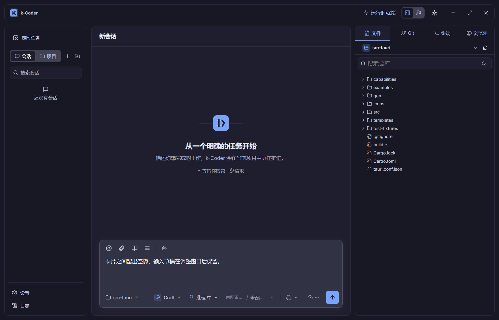

# 卡片式布局验证

- 日期：2026-09-15
- 路线图：P10-186，用户优先插入。
- 源码位置：`D:\code\Nick\k-coder`（本次实际工作区）。

## 改动

左侧会话列表、主会话区以及右侧工作台/子智能体面板使用 12px 圆角与细边框。标题栏下方、窗口两侧、底部和卡片之间保留 12px 留白；720px 以下外侧留白缩为 8px，右侧面板同样保持距窗口边缘的空隙。

根网格负责间距，标题栏作为横跨内容列的独立卡片。标题栏与窗口顶部、两侧均留 12px（窄屏 8px），统一圆角与细边框，关闭按钮的悬停背景贴合右侧圆角。拖动条位于卡片缝隙中央，保持 8px 命中宽度；宽度计算先扣除外边距与卡片间距，再为会话保留桌面 420px、中等窗口 360px。背景图的层级规则不再把拖动条的 absolute 定位覆盖为 relative，也不覆盖窄屏面板的 fixed 定位。

顶部追加留白后，拖动遮罩、右侧窄屏面板和文件预览遮罩统一使用内容区顶部坐标 `48px + 2 × inset`，不会遮住标题栏。520px 以下只显示品牌图标，运行状态文字保留给辅助技术，窗口操作和设置等按钮保持可见；720px 以下按钮间距收紧。

复用既有主题、背景图和输入区偏好。本次不改变运行时协议或安全策略。开始前已有的背景图上传、消息宽度、列表图标等修改，以及并行产生的背景图预览放大改动均保留。

## 验证结果

| 检查 | 结果 |
| --- | --- |
| `pnpm build` | 通过，保留既有大 chunk 提示 |
| `cargo fmt --manifest-path src-tauri/Cargo.toml -- --check` | 通过 |
| `cargo check --manifest-path src-tauri/Cargo.toml` | 通过 |
| `cargo test --manifest-path src-tauri/Cargo.toml` | 553 通过，3 个既有读取收敛测试失败 |
| Playwright 布局专项 | desktop/narrow 共 12/12 通过 |
| 隔离原生桌面 | 20/20 主题、背景和视口组合通过 |
| `git diff --check` | 通过，仅有 LF/CRLF 提示 |

Playwright 更新现有拖动测试，验证四周 12px、两条卡片缝隙 12px、拖动条位于缝隙并实际接收鼠标命中。其余覆盖拖动、键盘调整、iframe 上取消拖动、宽度记忆、响应式恢复、审阅层级和输入区无溢出。执行使用系统 Edge、Vite 1495。

原生实际启动 `pnpm tauri dev --no-watch --config src-tauri/target/card-layout-validation.json`，独立应用标识 `com.kcoder.validation.cardlayout`、Vite 1459、WebView2 CDP 9399。执行 `scripts/validate-card-layout-native.cjs`，在真实 WebView 上检查 light/dark × 背景关闭/开启 × 1400/900/722/700/376px 共 20 组，验证卡片外边距、会话最小宽度、根页面/输入区无横向溢出和草稿保持，并目视检查实际截图。

Windows 125% 缩放会将 721px 请求报告为 722px，因此原生脚本使用可稳定表示的视口尺寸，几何断言允许小于 0.5 CSS px 的像素舍入误差；精确 721/375px 由浏览器专项覆盖。原生检查使用空会话与本地文件工作台，没有调用模型。

Rust 失败名称与此前 P10-185 记录一致，本次没有修改 Rust：

- `agent::tests::read_recovery_delivery_only_hard_stops_the_corrected_provider_batch`
- `agent::tests::recovery_still_stops_varied_overlapping_reads_after_one_correction`
- `agent::tests::semantic_read_tracker_recovers_once_before_stopping_overlap_loops`

未提交或推送，未部署 `D:\apps\k-coder`。

## 顶部卡片追加验证

用户追加「还有顶部」后，重新执行 build、Rust fmt/check/test；Rust 仍为 553 通过、同名 3 项既有失败。更新 E2E 的标题栏四周留白断言与文件预览居中坐标，布局/审阅/输入区 6 项通过，文件工作台全流程 2 项通过。文件预览首次因旧测试固定断言 y=48 而失败，按新布局坐标更新后通过。

再次运行隔离 `pnpm tauri dev`，20 组主题/背景/尺寸检查全部通过，增加标题栏无横向溢出、顶部/两侧留白、窄屏右面板顶部间距，以及实际点击原生最大化/还原按钮的断言。原生检查发现极窄标题栏拥挤，完成按钮间距与文字收起适配后通过。截图更新为含顶部卡片的最终效果；375/376px 仅作为响应式压力验证，实际桌面最小窗口仍为 900px。

## 实际截图

