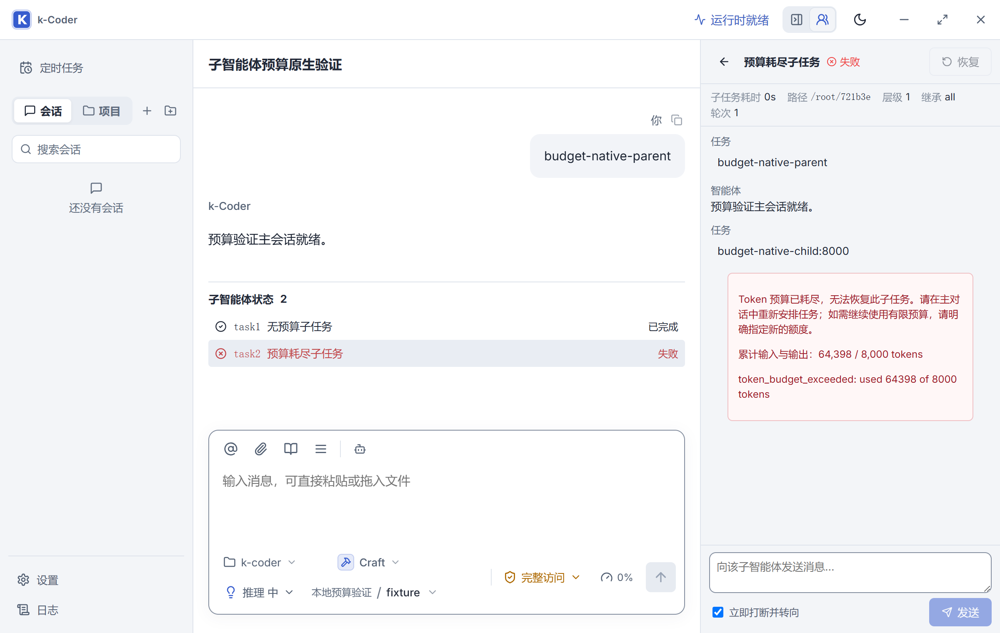

# 子智能体 Token 预算修复验证

日期：2026-09-14。路线图任务：P10-182。

## 故障与修复

用户截图对应子任务“测试范围分析”。持久化创建记录为 `tokenBudget: 8000`、`forkMode: all`；本次 Turn 两次 Provider 请求分别为 7,476 输入 + 302 输出 = 7,778，以及 56,218 输入 + 402 输出 = 56,620，合计 64,398。历史用量没有直接计入新 Turn，预算统计也没有误把输出当成全部消耗。

`multi_agent.rs` 原工具说明允许“小任务才设置”，主模型据此自行设了过小预算。修复后的顶层描述及参数描述都要求仅按用户明确要求设置预算，并解释累计输入/输出、继承历史、工具结果和跨 Turn 累计；不得依据任务大小或回复长度自行估算。恢复工具说明补充预算耗尽不能重试，也不能创建替代任务绕过用户指定预算。

`AgentActivityPanel.tsx` 按 `tokenBudget != null && tokensUsed >= tokenBudget` 判断耗尽，列表与详情恢复按钮同时禁用；失败/取消/超时详情提供中文原因和格式化用量，并保留原错误。无预算及仍有余额的普通失败保留恢复按钮。已完成任务不会因恰好达到预算被展示为错误。

不修改运行时预算执行语义、不自动重置旧任务预算、不修改真实历史。工具指引只能约束模型的预期行为，不能保证任意模型都服从；模型若仍传入数值预算，宿主继续按显式预算执行。

## 测试结果

修改前观察到两项预期失败：Rust 工具契约缺少用户明确要求约束；Playwright 耗尽任务的详情恢复按钮实际仍为 enabled。修改后均通过。

| 验证 | 结果 |
| --- | --- |
| `pnpm build` | 通过；保留既有大 bundle 提示 |
| `cargo fmt --manifest-path src-tauri/Cargo.toml -- --check` | 通过 |
| `cargo check --manifest-path src-tauri/Cargo.toml` | 通过 |
| `cargo test --manifest-path src-tauri/Cargo.toml` | 547 通过、3 个既有失败 |
| `cargo test --manifest-path src-tauri/Cargo.toml multi_agent::tests -- --test-threads=1` | 21/21 通过 |
| `pnpm test:e2e --grep 'exhausted subagent budget'` | desktop/narrow 2/2 通过 |
| `node scripts/validate-subagent-budget-native.cjs` | 原生链路通过 |

新增运行时回归以 `forkTurns: all` 启动任务，重放两次用量，验证无预算完成、显式预算失败、恢复拒绝不增加请求数、重载后状态及用量保持一致。界面回归覆盖 64,398/8,000、8,000/8,000、7,999/8,000 和 64,398/无预算。

全量失败项与 P10-181/P10-175 已记录集合相同，均位于未修改的读取收敛逻辑：

- `agent::tests::read_recovery_delivery_only_hard_stops_the_corrected_provider_batch`
- `agent::tests::recovery_still_stops_varied_overlapping_reads_after_one_correction`
- `agent::tests::semantic_read_tracker_recovers_once_before_stopping_overlap_loops`

## 原生验收

实际启动 `pnpm tauri dev --no-watch --config .tmp-ui/subagent-budget/tauri.conf.json`，独立标识 `com.kcoder.validation.subagentbudget`、Vite 1488、WebView2 CDP 9428。脚本通过真实 API、AgentRuntime、ToolRegistry、HTTP/SSE、持久化与 WebView 验证，Provider 是本机确定性测试服务，未调用外部模型。

验收父会话 `f9796011-f8c2-4b45-8e64-41d1bcfc0589`：

1. 真实 Provider 请求中包含修正后的创建工具说明。
2. 两个子任务继承父会话历史，均执行目录工具并累计 64,398 Token；省略预算的完成，8,000 预算的失败。
3. 直接恢复耗尽任务被后端拒绝，没有第三次子任务请求。
4. 刷新页面后，原状态和用量恢复，详情与列表中的恢复按钮禁用。
5. 截图 `subagent-budget-native.png` 已目视检查，中文原因与用量无裁切，恢复按钮呈禁用状态。

初次脚本执行遇到页面初始化的对象错误；后续测试把结构化 IPC 错误序列化后，发现恢复拒绝断言也需按对象读取而非 `String(object)`。修正验证脚本后完整链路通过。临时 Provider 配置与假凭据在 finally 删除。验收后已关闭隔离开发进程，1488/9428 端口无监听，既有正式实例仍在运行。

## 工作区与部署

本轮未执行 `git commit` 或 `git push`。工作期间其他操作把 HEAD 推进到 `5b4ab57`，该提交包含已写入的工具说明、界面和 E2E 修复；没有回退或改写该提交。后续 Rust 回归、原生验证脚本、截图和文档继续留在工作区。

未部署到 `D:\apps\k-coder\`，未自动恢复截图中的真实任务。验证使用隔离开发实例，正式运行实例需加载新构建后才会使用修复。
