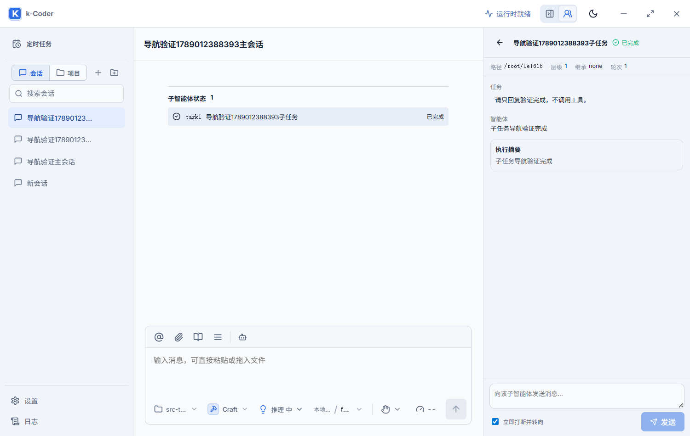

# 子智能体会话列表隐藏验证

- 日期：2026-09-10
- 路线图：P10-162
- 用户要求：子智能体不出现在会话列表，从主对话点击后在右侧面板查看详情。

## 实现

`AppState.list_conversation_threads` 先读取 Repository 列表或搜索结果，再根据多智能体协调器的持久化快照排除子线程 ID。`list_threads` 和 `search_threads` 共用此路径，所以前端的普通会话、项目内会话、项目数量、搜索、初始化和删除会话后的默认选择均使用相同结果。不按标题、前端异步加载的标记或任务运行状态判断子智能体。

删除侧栏两处子智能体图标按钮、专用 CSS 和 App 中仅用于侧栏标记的两份冗余映射。保留主对话 task 标签、子任务状态入口、右侧详情、历史读取和实时事件订阅。底层独立线程与子智能体快照继续保存，没有迁移、归档或删除用户数据。

## 自动化验证

| 检查 | 结果 |
| --- | --- |
| `pnpm build` | 通过；保留现有产物体积警告 |
| `cargo fmt --manifest-path src-tauri/Cargo.toml -- --check` | 通过 |
| `cargo check --manifest-path src-tauri/Cargo.toml` | 通过 |
| `cargo test --manifest-path src-tauri/Cargo.toml` | 514/514 通过 |
| `pnpm test:e2e e2e/workbench.spec.ts --grep subagent` | desktop/narrow 合计 8/8 通过 |
| `node scripts/validate-subagent-navigation-native.cjs` | 隔离原生桌面验证通过 |

新增 Rust 回归从真实持久化子任务快照恢复 AppState，覆盖 queued、running、blocked、completed、failed、cancelled、timed_out 七种状态（活动状态按既有规则恢复为失败），验证空查询、空白查询、同名匹配与无匹配搜索。两个同名普通会话（项目与无项目）仍保留，七个子线程全部隐藏；Repository 仍有九条记录，全部子任务历史可按 ID 读取。

既有双视口专项验证父对话 task1/task2 的详情定位、历史和草稿隔离、切换父会话、直接创建及排队状态，确认入口没有回归。

## 原生桌面验证

实际启动 `pnpm tauri dev --no-watch --config <临时配置文件>`，使用独立标识 `com.kcoder.validation.subagentnavigation`、Vite 1451、WebView2 调试端口 9391。脚本通过真实 IPC 创建父会话和子任务，本机回环 SSE 返回确定性回复，不调用外部模型；使用临时假凭据，并在 finally 中删除该凭据和供应商配置。

实际断言：

1. 真实 `list_threads` 与 `search_threads` 不包含子线程，仍包含父会话。
2. 子任务较新时，页面刷新仍默认选中主会话。
3. 项目列表和搜索仅显示父会话，匹配结果计数为 1。
4. 隐藏项目分组后，普通会话列表仍不显示子任务，搜索子任务标题显示无匹配。
5. 点击主对话子任务状态入口后，右侧展示正确标题和真实历史回复，主会话保持选中。

脚本执行结果为 PASS；验证截图如下。测试数据仅写入隔离实例，正式安装的应用与用户数据未修改。

修改留在工作区，未 commit、push 或重新部署正式安装包。
