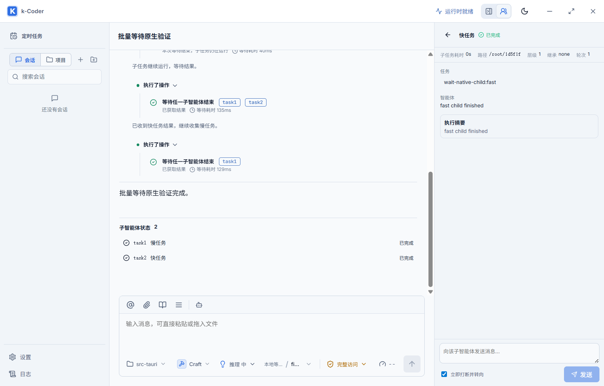

# 子智能体批量等待优化验证

- 日期：2026-09-10
- 路线图：P10-163
- 决策：ADR 0057

## 行为变化

主任务启动独立子智能体后，提示其先推进自身不依赖子结果的工作，再调用等待；不为了忙碌重复阅读已委派的内容。工具描述对所有拥有委派能力的运行时可见，根任务的普通与重试请求还通过最终工具注册表按需注入调度指令。

`wait_agent` 支持二选一参数：原有 `agentId` 返回完整单任务快照，新增 `agentIds` 接受 1～4 个唯一 ID，任一目标达到终态即返回版本化结果。先验证整个批次属于当前父会话，不因其中一个自有任务已经完成而跳过其他目标的检查。

等待使用通知而非轮询，在读取状态前登记通知，并保持固定截止时间。等待超时返回当前快照而不停止子任务；取消遵循既有令牌范围。只在实际阻塞至少 1 秒、成功返回且目标全部仍活动时重置重复调用与无进展计数，防止长任务连续等待被误停；0ms 快照、快速轮询、已结束结果、错误与其他工具仍保留保护。

批量快照省略可能很大的任务正文，每项摘要最多 4096 UTF-8 字节、错误最多 512 字节，并返回 `truncated` 标记；即使包含大量 JSON 转义字符也保持低于 128 KiB 工具输出限制。需要完整信息时使用原有单任务快照接口。

对话行显示本次等待全部 task 标签，并用“等待耗时”区分工具调用时间。超时显示“本次等待结束，子任务仍在运行”；右侧列表与详情显示“子任务耗时”。该耗时是从创建到最近状态更新的生命周期时间，包含等待和恢复间隔，并非模型纯计算时间或精确的每轮执行时间。

## 自动化检查

| 检查 | 结果 |
| --- | --- |
| `pnpm build` | 通过；保留既有大产物提示 |
| `cargo fmt --manifest-path src-tauri/Cargo.toml -- --check` | 通过 |
| `cargo check --manifest-path src-tauri/Cargo.toml` | 通过 |
| `cargo test --manifest-path src-tauri/Cargo.toml` | 519/519 通过 |
| 子智能体 Rust 专项 | 17/17 通过 |
| `pnpm test:e2e e2e/workbench.spec.ts --grep subagent` | desktop/narrow 合计 10/10 通过 |
| `node scripts/validate-subagent-wait-native.cjs` | PASS |

新增四项多智能体测试覆盖真实快/慢 Provider 顺序、固定截止时间、取消不关闭子任务、全部终态与多个等待者、立即快照、旧接口兼容、大小/Unicode 截断、无效输入和跨父会话拒绝。新增运行时测试验证仅正常阻塞等待豁免循环保护；扩展提示词测试验证有能力时注入、无项目时不暴露调度能力。

新增 Playwright 场景在 desktop/narrow 下检查四个标签、等待计时、超时与结果文案、task3 详情定位和子任务耗时。测试流程遵循已完成工具组自动收起行为，并在打开详情之前完成父事件注入，因为当前 mock 事件桥每个事件名仅保存一个订阅回调；真实 Tauri 多订阅行为由原生测试覆盖。

## 原生桌面验证

实际启动 `pnpm tauri dev --no-watch --config C:/Users/nealk/AppData/Local/Temp/kcoder-wait-any-tauri.json`，使用独立应用标识 `com.kcoder.validation.waitany`、Vite 1454 和 WebView2 调试端口 9394。脚本使用真实 IPC、ToolRegistry、PolicyEngine、AgentRuntime、HTTP/SSE、持久化和 WebView；模型由本地确定性服务模拟，不调用外部模型。

通过的完整路径：

1. Provider 请求确实包含多任务工具 Schema 和调度指令。
2. 主任务创建两个独立子任务后先执行 `list_directory`。
3. 第一次批量等待超时，两个子任务均继续活动。
4. 释放第二个快任务；等待立即返回该任务结果，第一个慢任务保持运行。
5. 仅等待剩余慢任务，完成后主任务输出汇总。
6. 刷新页面并展开历史工具组，超时/完成结果、等待耗时和多个 task 标签均正确恢复。
7. 点击 task2，右侧打开快任务详情并显示真实子会话回复和子任务耗时。

测试使用隔离数据目录，临时假凭据和供应商配置由脚本 finally 清理。工作区保留已有未提交改动，本次未 commit、push 或部署正式安装包。
