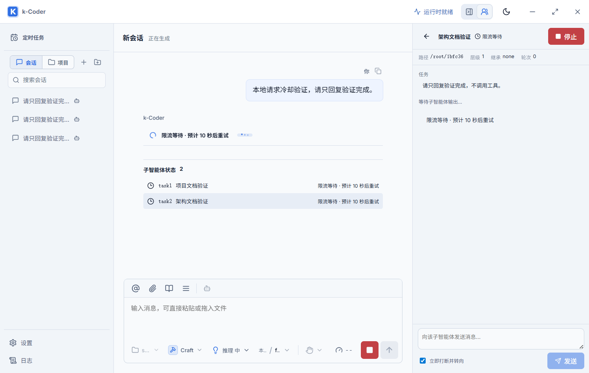

# 子智能体限流恢复与状态展示修复（P10-161）

日期：2026-09-10。

## 问题与修复

截图对应会话中，两个子任务实际并行启动，但主模型只调用了一个 `wait_agent(task2)`。原界面只展示该工具，容易让用户误以为另一个任务没有运行。新增父会话范围内的全部子任务状态列表，与等待工具的执行状态分别表达；空会话直接创建子任务也立即展示。task 标签与工具标题同行并保持内容宽度，可点击定位详情。

两个子任务收到的真实错误为 HTTP 429，每分钟限额 15 次。原策略在 1、2、4 秒后重试，未读取 Retry-After；主模型改为串行恢复后仍再次失败。现在 HTTP 适配器统一保留类型化限流与 Retry-After 秒数/HTTP 日期；缺失提示时冷却 60 秒，仍最多自动重试三次。错误落盘使用 `rate_limited`，旧 `HTTP 429:` 消息兼容分类。

AppState 按供应商配置 ID 持有共享准入状态，主任务、子任务、手动恢复与重建的 Provider 共用。冷却结束后错开放行请求：首次限流后间隔 4 秒，再次限流加倍至最多 60 秒，避免同时重试。已有 FallbackProvider 内的配置路由顺序保留，调度器不添加未配置的目标。

schema v7 新增瞬时 `provider_retry_waiting`，主对话、子任务列表与详情显示预计等待时间。子任务的可选 `retryAtMs` 不改变运行状态及权限；请求开始或任务结束时清除。取消等待不会发起下次请求，模型恢复任务也继承父级取消令牌。已有部分正文、工具或私有上下文输出不重放。

## 验证结果

| 检查 | 结果 |
| --- | --- |
| `pnpm build` | 通过；保留既有大产物提醒 |
| `cargo fmt --manifest-path src-tauri/Cargo.toml -- --check` | 通过 |
| `cargo check --manifest-path src-tauri/Cargo.toml` | 通过 |
| `cargo test --manifest-path src-tauri/Cargo.toml` | 513/513 通过，main 与 doc tests 通过 |
| `pnpm test:e2e --grep 'rate limit waiting\|subagent'` | desktop/narrow 合计 10/10 通过 |
| 原生 `pnpm tauri dev --no-watch` 变更路径 | 通过，详见下文 |

新增 Rust 回归覆盖共享冷却跨 Provider 重建、不同配置隔离、并发等待错峰、延长冷却、取消不占未来时隙、Retry-After 两种格式与边界、真实 HTTP 429 脱敏、错误码、重试次数、部分输出不重放及恢复子任务的父级取消。

Playwright 覆盖单个 wait_agent 时两个子任务都可见、task 标签宽度、主任务与详情倒计时、失败后清除等待、面板 task 切换与父会话隔离、排队/取消、空会话直接创建子任务。

## 原生验证

使用独立标识 `com.kcoder.validation.quota` 启动真实 Tauri 开发窗口，Vite 1441、WebView2 调试端口 9381。验证脚本为 `scripts/validate-quota-native.cjs`，仅连接回环 HTTP 测试服务并使用临时假凭据，结束后清除测试 Provider 和凭据。

通过真实 Tauri 命令创建两个子任务并启动一个父任务，测试服务首次返回 `429 + Retry-After: 10`，后续返回正常 SSE。三者在冷却期均保持等待，HTTP 调用总数为 4（一次限流、三次成功），父任务及两个子任务全部完成。首次成功请求距限流约 10 秒；重复运行时同一配置保留自适应间隔，后续请求间隔实测约 8 秒、16 秒，与冷却及错峰逻辑一致。实际点击子任务详情并验证了倒计时显示。

验证覆盖真实 AgentRuntime、Provider HTTP、子任务生命周期、Tauri 事件和原生 WebView；没有向收费模型发请求。

## 实际边界

- 限流仍取决于上游额度；持续拒绝会在三次重试后明确失败，不保证绕过配额。
- 共享范围是当前进程内的同一供应商配置 ID。相同账号另存为不同配置、其他进程消耗额度不在同一调度范围；应用重启清除冷却与自适应间隔。
- 子任务原有总超时继续执行，长 Retry-After 可能先触发任务超时。
- 本次为源码工作区修改，未 commit、push 或部署。其他任务的 P10-160 面板隔离改动完整保留；本报告的最终全量 Rust 验证已覆盖其报告中早前的 schema v6/v7 断言差异。
