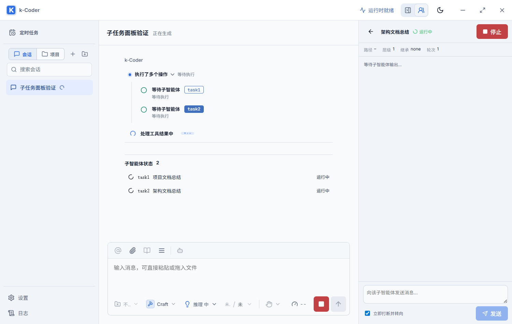

# 子智能体面板按任务展示验证

- 日期：2026-09-10
- 路线图：P10-160
- 范围：点击对话 task 时仅展示对应子智能体；返回列表仅展示当前父会话的子任务。

## 实现

`AgentActivityPanel` 移除独立的全局列表加载和生命周期订阅，统一读取 `App` 已有的子智能体投影。创建、停止和恢复返回的快照也回写同一投影。这样新收到的子任务事件不会被面板再次加载的历史快照覆盖。

所选 ID 只定位一个详情，详情以智能体 ID 为 React key，切换时重新建立历史读取、实时订阅和草稿状态。未取得所选快照时显示加载状态，不回退展示历史列表。选择绑定点击时的父会话，切换会话立即隔离旧选择并清空面板局部状态。

列表及运行计数使用相同的父会话过滤条件。其他会话的实时事件仍进入共享投影，但不显示在当前列表中。持久化记录、运行时、授权与工具行为不变。

## 自动化验证

命令：`pnpm test:e2e e2e/workbench.spec.ts --grep 'subagent'`。

desktop 和 narrow 合计 **6/6 通过**，覆盖：

- 无默认 Token 预算的创建路径与创建后的详情定位。
- 从对话点击 task1、task2，面板始终只显示所选详情。
- task1 的历史、实时输出与未发送草稿不会进入 task2。
- 返回列表只显示当前会话两个子任务及正确运行数。
- 当前任务完成事件更新计数，其他会话实时事件不混入列表。
- 切换父会话重置详情，空会话展示空状态，切回后不恢复旧详情。
- 既有同批 wait_agent 排队展示和取消回归。

## 原生桌面验证

启动真实 `pnpm tauri dev --no-watch`，使用临时配置的隔离标识 `com.kcoder.validation.subagentfocus`、Vite 1431 和 WebView2 调试端口 9371。主窗口显示“运行时就绪”。

在原生 WebView 中设置临时展示夹具，通过真实 Tauri 事件总线注入子任务生命周期与工具排队事件，实际点击 task1/task2。断言详情标题、旧实时输出清空、旧草稿清空、返回列表仅两项、运行计数为两项以及其他父会话任务不可见均通过。没有发起模型请求，也没有修改正式应用的会话数据；该验证覆盖原生点击和展示路径，不代表执行了真实模型委派。

截图：

## 仓库质量门槛

| 检查 | 结果 |
| --- | --- |
| `pnpm build` | 通过；现有较大产物警告不影响构建 |
| `cargo check --manifest-path src-tauri/Cargo.toml` | 后续执行通过 |
| `cargo fmt --manifest-path src-tauri/Cargo.toml -- --check` | 执行时未通过，差异位于共享工作区并行修改的 agent、app_state、providers Rust 文件 |
| `cargo test --manifest-path src-tauri/Cargo.toml` | 本次全量运行 502 通过、2 失败；并行修改将事件 schema 升为 v7，`queued_tool_event_exposes_the_complete_call` 与 `usage_event_separates_turn_totals_from_the_active_context_window` 仍断言 v6 |
| 子智能体 Playwright 专项 | 6/6 通过 |
| 原生 WebView 变更路径 | 通过 |

本任务没有修改 Rust 文件。上述 Rust 结果是验证时共享工作区的快照，不能宣称全仓质量门槛全部通过；其他任务继续修改后应以其最终验证结果为准。代码留在工作区，未 commit 或 push。
