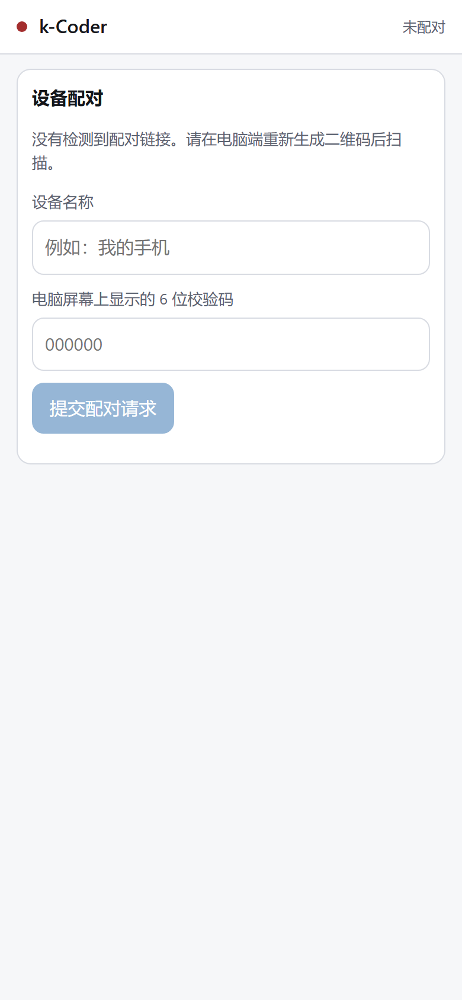
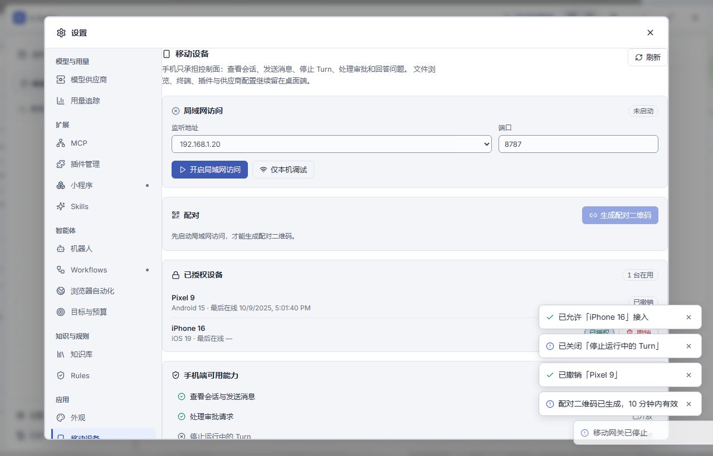
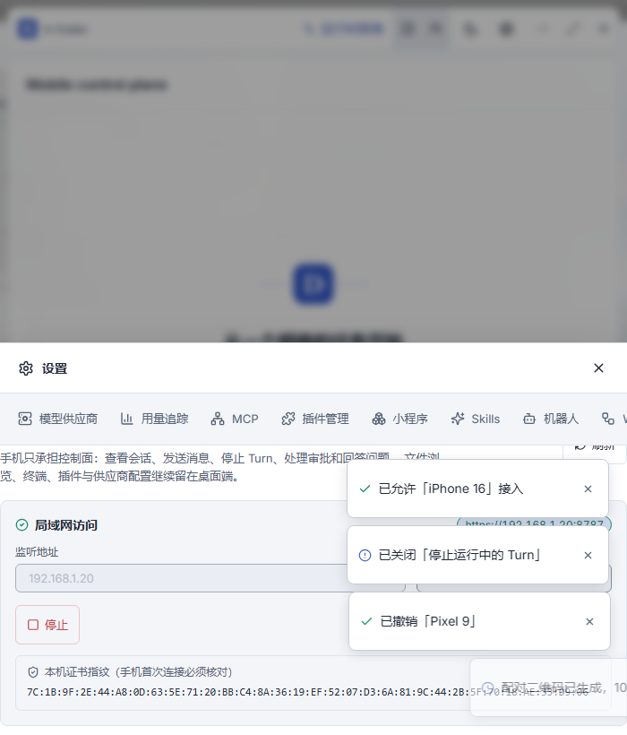

# 手机局域网直连（方案 1）验证

对应设计文档 `docs/superpowers/specs/2026-09-15-mobile-control-design.md` 的阶段 B，以及 ADR 0059。

## 交付范围

桌面进程内新增局域网控制面网关，手机浏览器作为轻量控制面。工作区、Provider 凭据、`AgentRuntime`、`ToolRegistry`、`PolicyEngine` 与 `ThreadRepository` 全部留在桌面端。

| 交付项 | 位置 |
| --- | --- |
| 协议与结构化错误 | `src-tauri/src/mobile/protocol.rs` |
| 能力门控 | `src-tauri/src/mobile/capability.rs` |
| 配对、设备登记、令牌 | `src-tauri/src/mobile/auth.rs` |
| 出站队列、补发缓冲、事件投影入口 | `src-tauri/src/mobile/events.rs` |
| 移动安全投影 | `src-tauri/src/mobile/view.rs` |
| JSON-RPC 分派 | `src-tauri/src/mobile/rpc.rs` |
| 运行时边界 | `src-tauri/src/mobile/host.rs` |
| HTTP/WS 服务、来源校验、限流 | `src-tauri/src/mobile/server.rs` |
| 自签证书与指纹 | `src-tauri/src/mobile/tls.rs` |
| 服务编排 | `src-tauri/src/mobile/mod.rs` |
| 手机端单文件 PWA | `src-tauri/src/mobile/assets/mobile.html` |
| Tauri 命令 | `src-tauri/src/commands/mobile.rs` |
| 传输层集成测试 | `src-tauri/tests/mobile_gateway.rs` |
| DTO 线上契约测试 | `src-tauri/tests/mobile_dto_contract.rs`、`e2e/fixtures/mobile-dto.json` |
| 原生验收工具 | `scripts/verify-mobile-native.mjs` |
| 桌面设置页 | `src/components/MobileSettingsPage.tsx`、`MobileSettingsPage.css`，注册于 `src/components/SettingsDialog.tsx` |

接入点：`src-tauri/src/lib.rs` 注册 `MobileService` 与 8 个命令；`src-tauri/src/commands/mod.rs` 的 `TauriEventPublisher::publish` 并联扇出到移动网关，并抽出 `enqueue_message_turn` 供桌面与手机共用；`src-tauri/src/app_state.rs` 暴露 `data_root()`。

## 验收覆盖

### 协议与生命周期

`initialize` 之前只接受 `initialize` 与 `ping`，`initialized` 之后才放行其余方法；版本不匹配返回 `unsupported_capability` 语义的结构化错误。错误载荷统一带 `kind`、`retryable`，必要时带 `retryAfterMs` 与 `details`。

### 认证与配对

一次性挑战 10 分钟有效、单次使用、最多 5 次错误尝试后锁定；6 位人工校验码；挑战密钥只出现在配对 URL 的 fragment。设备密钥与刷新令牌只以 SHA-256 摘要落盘，访问令牌只驻内存且 15 分钟过期，撤销立即失效，刷新轮换旧令牌。

### 事件投递与恢复

有界出站队列加连接内单调 `deliverySeq`，配合 512 条补发缓冲。可丢弃事件在队列满时被丢弃，关键事件在队列满时改发 `resync_required`；游标早于缓冲最旧或晚于最新时返回 `resume_required`（`cursor_expired`、`cursor_not_buffered`），客户端改为重新 `thread/read` 取快照。未订阅的线程不投递。

### 移动安全投影

`ThreadItemPayload::Reasoning` 不投影；工具原始参数、补丁正文、文件内容、unified diff、图片 base64 均被剥离；路径只给工作区相对形式；`ThreadWorkspaceMismatch` 等含绝对路径的错误映射为不含路径的 `forbidden`。

### 审批与幂等

手机不持有补丁正文，批准时由服务端从 `PendingRequestIndex` 保存的 preview 生成 `selectedPaths` 与 `expectedHashes`，与桌面语义一致。写方法按「设备 + 方法 + requestId」幂等去重，移动网络重试不产生重复 Turn。

### 网络与边界

非回环绑定强制 TLS，只监听回环时允许明文；只接受回环、RFC1918、ULA 与链路本地来源；带转发头的请求拒绝；`Host` 头必须命中本机地址白名单；握手与配对按 IP 限流；公网绑定被拒绝。

## 本轮执行结果

| 命令 | 结果 |
| --- | --- |
| `pnpm build` | 通过（`tsc` 无错误，`vite build` 成功） |
| `cargo fmt --manifest-path src-tauri/Cargo.toml -- --check` | 本轮新增与修改的文件通过；全仓库仍报 1 个文件，属并行工作流正在写入的 `src-tauri/src/storage/memory_repository.rs` |
| `cargo check --manifest-path src-tauri/Cargo.toml --all-targets` | 通过 |
| `cargo test --lib mobile::` | 76 通过 / 0 失败（移动模块单元测试） |
| `cargo test --test mobile_gateway` | 19 通过 / 0 失败（传输层集成测试） |
| `cargo test --test mobile_dto_contract` | 6 通过 / 0 失败（前后端 DTO 线上契约） |
| `playwright test e2e/mobile-settings.spec.ts` | 2 通过 / 0 失败（desktop + narrow） |
| `node scripts/verify-mobile-native.mjs phone` | 29 通过 / 0 失败（真实客户端进程 + 真实网卡 + 手机协议客户端） |
| `node scripts/verify-mobile-native.mjs pwa` | 9 通过 / 0 失败（真实 Chromium 打开手机端页面） |
| `cargo test --lib`（全量） | 635 通过 / 16 失败，失败项与本轮改动无关，见下 |

全量失败项分两类，均不涉及 `mobile` 代码：

1. **3 项既有失败**：`agent::tests::read_recovery_delivery_only_hard_stops_the_corrected_provider_batch`、`agent::tests::semantic_read_tracker_recovers_once_before_stopping_overlap_loops`、`agent::tests::recovery_still_stops_varied_overlapping_reads_after_one_correction`。与路线图记录的既有读取收敛失败一致。
2. **13 项环境失败**：10 项符号链接逃逸类（`extensions::*`、`patch::*`、`tools::*` 中的 link/reparse escape）加 3 项 `rg`/PowerShell 类。本机符号链接创建异常：创建后 `lstat` 报告 `isSymbolicLink=false` 且长度为 0，或被报 `EEXIST`，因此"链接逃逸必须被拒绝"的用例拿不到链接。沙箱内外结果一致（均为 635 通过 / 16 失败），确认不是沙箱产物。同一异常也是本轮 `node_modules` 依赖链接变成空目录的原因。

## 前后端 DTO 线上契约

设置页读的字段名与 Rust 序列化出来的字段名原本各写一份，没有任何东西保证它们一致：Playwright 用打桩的 `invoke` 加手写桩数据，桩数据错了它也不会发现；`tsc` 只检查 `src/` 里的手写类型自洽，看不到 Rust。字段改名后界面上的值会静默变成 `undefined`。

现在两边共用唯一数据源 `e2e/fixtures/mobile-dto.json`：

- `src-tauri/tests/mobile_dto_contract.rs` 读取该文件，用其中的值构造 `MobileDeviceView`、`MobilePendingPairingView`、`MobilePairingView`、`MobileStatus`，再序列化回来做**全等**断言——字段改名、改大小写、改可空性、多出或漏掉字段都会失败。同时断言 `MobileCapability` 的 8 个名字，其中名称映射写成穷尽 `match`，新增能力变体会直接编译失败，逼着同步前端 `Capability` 联合类型。
- `e2e/mobile-settings.spec.ts` 用同一个文件当桩数据，所以前端是否真的读得对，会跟着同一份数据被重新校验。

已验证这条约束不是空转：把设备对象的 `name` 改成 `label`，Rust 侧 2 项失败、Playwright 两个视口同时失败；改回后两侧恢复通过。

## 原生验收

`scripts/verify-mobile-native.mjs` 是一个零依赖验收工具（只用 `node:tls` 与手写 WebSocket 帧编解码），用来验证 Playwright 打桩与 Rust 集成测试都覆盖不到的那一段：**真实进程、真实网卡、真实自签证书、真实 SQLite 会话数据**。

它先把应用数据目录下的 `mobile/state.json` 备份并写入一份验收状态（`enabled=true`、监听真实局域网地址、登记一台验收设备与一台已撤销设备），这样 `MobileService::restore_on_startup` 会在客户端启动时自动拉起网关，无需人工点击设置页。跑完用 `restore` 子命令还原，**验收设备记录会被删除**。

实测环境：Windows，局域网地址 `192.168.0.220`，网关监听 `8787`，应用数据目录 `%APPDATA%\com.kcoder.app\runtime-data`。

### `phone`：手机协议客户端

以手机身份用真实 TLS 连接运行中的客户端，29 项断言全部通过：

| 分组 | 关键结果 |
| --- | --- |
| 传输层 | TLSv1.3 握手成功；服务端证书指纹与本地 `cert.pem` 逐位一致（`AB:31:79:2F:…:91:F8`）；自签证书未被系统信任（预期，手机端靠指纹核对）；`GET /health` 返回 `protocolVersion=1`；`GET /m/` 返回 38434 字节内联页面且无任何外部资源引用；`GET /` 308 跳转 `/m` |
| 来源与请求头 | 伪造 `Host` → 403；`X-Forwarded-For` → 400；`Forwarded` → 400 |
| JSON-RPC 生命周期 | 升级成功且 `Sec-WebSocket-Accept` 校验通过；未 `initialize` 即调用 `thread/list` → `unauthorized`；设备密钥换会话成功，返回 `server=k-coder@0.10.0` 且指纹与本地一致；`initialized` 后进入 ready；错误设备密钥 → `unauthorized` |
| 真实会话数据 | `thread/list` 返回 **42 条真实会话**（来自桌面端 SQLite，标题为真实中文标题）；`thread/read` 在会话「推送代码」上返回 **1 个 turn / 227 项**；对 227 项做投影泄漏扫描，未发现工具参数、补丁正文、文件内容或私有推理字段 |
| 失败路径 | 未知方法 → `method_not_found`；缺参 → `invalid_params`；`file/read`、`shell/run` 在未授权能力下 → `unsupported_capability`（`details.capability=fileRead`）；协议版本 99 → `unsupported_capability`（`details.supportedVersion=1`） |
| 设备撤销 | 已撤销设备即使密钥正确也 → `unauthorized`（`device was revoked`） |

### `pwa`：真实浏览器打开手机端页面

用真实 Chromium（390×844、移动 UA、`ignoreHTTPSErrors`）打开 `https://192.168.0.220:8787/m/`，9 项断言全部通过：

- 页面正常加载，标题 `k-Coder 手机控制`；缺少配对链接时提示「没有检测到配对链接。请在电脑端重新生成二维码后扫描。」并禁用提交。
- 带配对链接时进入校验码输入态；页面自身发起的 `POST /pair` 能拿到服务端错误并展示（`pairing challenge is unknown or already replaced`），说明 `connect-src 'self'` 没有挡住页面自己的 fetch。
- **浏览器端同源 `wss` 升级与 `initialize` 未被 CSP 拦截**——`default-src 'none'` 的 CSP 很容易把 WebSocket 一起挡掉，这条断言专门守这个风险。
- 两个页面均无 CSP 违规；未发失败请求的页面控制台无任何报错。

## 本轮修掉的三个真实缺陷

前两个缺陷只有在原生验收里才暴露出来，单元测试与传输层集成测试都没抓到；第三个是后续补做异地访问（方案 A）时发现的。

1. **`thread/subscribe` 的游标与 `events/resume` 差一。** `EventHub::subscribe` 返回的是「下一个待分配序号」（`next_delivery_seq`），而 `events/resume` 的 `afterDeliverySeq` 期望的是「最后已分配序号」（`next_delivery_seq - 1`）。同一个字段名在两个方法里语义不同，导致手机端 `mobile.html` 把订阅返回值直接存成游标后，**每次重连都会拿到一个超过 `latest` 的游标**，被服务端判成 `cursor_not_buffered`，增量补发形同虚设，用户还会看到一次误导性的「事件游标已过期」。已改为返回 `next_delivery_seq - 1` 并补上语义注释，新增回归测试 `mobile::events::tests::subscribe_cursor_is_directly_resumable`；原生验收里也加了「订阅游标可直接用于 `events/resume`」与「越界游标仍返回 `resume_required`」两条断言。
2. **配对链接在同一文档内改 hash 时不会被重新解析。** `readPairingFragment()` 只在启动时调用一次。手机浏览器对「同源同路径、只有 hash 不同」的跳转不重新加载页面，因此用户若已经打开着 `/m/`，再点开配对链接会停在「没有检测到配对链接」。已加 `hashchange` 监听，仅在未配对时重新解析。原生验收里 `pwa` 的「同文档 hash 变化后重新解析配对链接」守这条。
3. **设置页的监听地址只能从下拉框里选，无法手填。** `MobileSettingsPage.tsx` 原本用 `<select>`，选项来自 `detect_lan_addresses()`——那个函数只探测默认出口网卡。而异地访问（方案 A）要填的是隧道地址（例如 WireGuard 的 `10.8.0.2`），它永远不会出现在候选里，也就是说**这条路从界面上根本走不通**，只能靠改状态文件绕过去。已改成 `<input list>` + `<datalist>`：保留自动探测作为候选，同时允许手输任意回环/私网地址。地址合法性仍由 Rust 侧 `resolve_bind_ip` 把关，前端不做重复校验。
   `server.rs` 同时补了两条回归测试钉住契约：`wireguard_tunnel_address_passes_every_gate`（`10.8.0.2` 能通过全部四道门）与 `cgnat_sources_are_rejected_today`（`100.64.0.0/10` 被拒——Tailscale/ZeroTier 默认落在这一段，不在 Rust `Ipv4Addr::is_private()` 的范围内）。

## 浏览器专项（桌面设置页）

`e2e/mobile-settings.spec.ts` 用 `addInitScript` 打桩 `__TAURI_INTERNALS__.invoke`，覆盖设置页的完整交互路径：运行中的地址与证书指纹展示、已有配对挑战的二维码与人工校验码、待确认设备批准后进入设备列表（`1 台在用` → `2 台在用`）、能力开关调用 `mobile_set_capabilities` 且参数为 `["chat", "approval"]`、设备撤销后列表显示「已撤销」、重新生成挑战调用 `mobile_create_pairing`、停止后回到「未启动」且配对入口禁用。桌面与窄屏两个视口均通过，窄屏无横向溢出。

## 异地访问：先复用本网关，不做出站中继

设计文档里的方案 2（出站中继）仍未实现。异地访问先走**自建 WireGuard 隧道复用本网关**这条路，完整搭建步骤见 `docs/手机异地访问-WireGuard中继搭建.md`。

选它的理由是**零 Rust 代码改动**：WireGuard 是三层隧道，不引入任何 HTTP 转发头，源地址保持私网语义，因此 `10.8.0.0/24` 能原样通过 `server.rs` 的四道门（源地址、`Host` 头、转发头、绑定地址）。上面第 3 个缺陷（监听地址只能选不能填）就是这条路上唯一的代码障碍，已修掉。

需要说清楚的边界：这条路**不是**方案 2，它只是把方案 1 的网关搬到隧道里跑，仍然要求用户自己维护一台 VPS 与三个密钥对；而设计文档禁止的「把方案 1 的端口直接暴露到公网」这件事，仍然被四道门挡着，没有被绕过。

## 仍未验证的部分

已启动真实 `pnpm tauri dev` 并让网关在真实网卡上监听，桌面到手机的主链路已在运行中的客户端跑通。以下仍未覆盖，不应据此扩大结论：

1. **真实手机设备**。`pwa` 用的是桌面 Chromium 配移动视口与移动 UA，不是真机。真机上的扫码、`localStorage` 持久化、切后台再回前台重连、以及 iOS Safari 对自签证书的处理都还没验证。
2. **设置页按钮到网关的真实命令往返**。`restore_on_startup` 是绕过界面直接读状态文件拉起的，所以「真实 `invoke` → 真实 Tauri 命令 → `MobileService`」这段接缝没有被原生覆盖；设置页的交互由 `e2e/mobile-settings.spec.ts` 对打桩的 `invoke` 覆盖，字段契约由 `mobile_dto_contract.rs` 钉住。
   本轮已把**结构性改动**做完：`MobileService` 泛型化到 `MobileService<R: Runtime = Wry>` 并拆出 `with_host`（可注入桩宿主），`commands/mobile.rs` 的 8 个命令全部泛型化到 `R: Runtime`，测试用 `tauri::test` 的 mock runtime 直接调用真实命令函数（覆盖状态查询、绑定地址校验、端口 0 拒绝、真实 socket 起停往返、停止幂等、未启动时创建配对、能力集往返、未知 id 失败关闭）。`TauriHost` 刻意保持具体运行时——它的 `start_turn` 会级联到 `commands` 里的 Turn 执行链，整体泛型化不划算。
   但**这套测试在 Windows 上跑不起来**，原因是平台层面的：mock runtime 会把窗口层链进测试二进制，从而导入 `comctl32.dll!TaskDialogIndirect`——Common Controls v6 的专有导出（经 `tauri-plugin-dialog` → `rfd` 带入）。lib 测试二进制没有 v6 清单声明时，加载器把它解析到 System32 下的 v5.82，报 `STATUS_ENTRYPOINT_NOT_FOUND`（`0xc0000139`），进程在跑任何用例之前就死掉（表现为 `cargo test --lib` 无输出直接失败）。已确认仓库里所有 `k_coder_lib-*.exe` 都不含任何清单。
   修复已落地但**默认关闭**，三条约束值得记下来：
   - 补清单只能走 `cargo:rustc-link-arg`。`cargo:rustc-link-arg-tests` 只作用于 `tests/*.rs` 集成测试目标，对 lib 单元测试完全无效（Cargo 会直接报 `does not have a test target`）；而 `rustc-link-arg` 是唯一覆盖 lib 单元测试的作用域，代价是它同时作用于 bin，会和 `tauri_build` 经 `cargo:rustc-link-arg-bins` 注入的应用清单叠加。所以整块挂在 `mock-runtime-tests` feature 后面，默认构建完全不受影响。
   - `src-tauri/windows/tests.manifest` 必须**纯 ASCII**：`mt.exe` 不按 XML 声明里的 `encoding="UTF-8"` 解析，而按 ANSI 代码页，出现中文会报「无法分析请求的 XML 数据」并以 `LNK1327` 失败。
   - 跑法：`cargo test --lib --features mock-runtime-tests`。加 `--lib` 是刻意的，避免 bin 目标被叠加第二份清单。
   链接参数机制先用一个独立最小 crate 完整复现并证明（无清单 → `0xc0000138` 加载即死；`rustc-link-arg` 嵌入 v6 清单 → 正常加载通过；清单含中文 → `mt.exe` 解析失败 `LNK1327`；纯 ASCII 注释 → 正常）。
   **测试结果**：主工作区本轮被并行工作流（见文末第 3 条）的中间态卡在编译不过，因此验证是在**工作区副本**上做的（副本里临时补掉并行工作流的 3 处报错，`CARGO_TARGET_DIR` 指向主仓库的 `src-tauri/target` 复用依赖）。两条命令都在**真实 k-coder crate** 上跑通：

   | 命令 | 结果 |
   | --- | --- |
   | `cargo test --lib --features mock-runtime-tests commands::mobile` | **9 通过 / 0 失败** |
   | `cargo test --lib mobile::`（feature 关闭） | **78 通过 / 0 失败** |

   9 项覆盖：停止态状态投影、服务未注册时的 `internal_error`、非法绑定地址的错误翻译、端口 0 拒绝、真实 socket 起停往返、停止幂等、未启动时创建配对、能力集往返、未知 id 失败关闭。第二行证明**默认构建路径完全不受影响**（feature 关闭时测试模块不编译，计数与改动前一致）。
   过程中测试自己也抓到一个错误断言：`status_reports_a_stopped_gateway` 原本断言停止态下 `capabilities` 为空，实际上它是 `CapabilityPolicy` 里**已配置**的授权集（新建服务即 `DEFAULT_GRANTED`），与运行状态无关——已改为断言等于 `DEFAULT_GRANTED` 并注明语义，防止将来被误改成运行态字段。
3. **运行中 Turn 的流式事件、取消与审批往返**。本轮已用**真实 `AgentRuntime` + `FakeProvider`** 自动化覆盖（`src-tauri/tests/mobile_turn_lifecycle.rs`，6 项全通过），因此这一条**不再依赖真实 Provider 额度**。做法：新测试宿主实现 `mobile::host::GatewayHost`，`app_state()` 返回真的 `AppState`，`start_turn()` 先 `begin_turn_with_id_in_workspace` 登记 active turn（`turn/interrupt` 要求线程已登记且 `turnId` 匹配），再立刻返回 `TurnHandle { state: Streaming }` 并把 `run_turn_with_attachments_and_id` 放进后台任务；publisher 与生产侧 `TauriEventPublisher` 同形状，用 `app.try_state::<MobileService<MockRuntime>>()` 惰性查找再调 `MobileService::publish_event`。测试**完全不起 HTTP/TLS/WebSocket**（传输层已由 `mobile_gateway.rs` 的 19 项覆盖），直接对 `mobile::rpc::dispatch` 发 `initialize`/`initialized`/`thread/subscribe`/`turn/start`，再从 `EventHub::register()` 拿到的 `OutboundQueue` 逐帧读。

   | 场景 | 实测结论 |
   | --- | --- |
   | (a) `TextDelta` 实时推送 | 帧序为 `turn_started` → 3 个 `text_delta` → `turn_completed`，分片内容与顺序与 `FakeProvider` 脚本逐字一致（`["Hello", " from", " fake"]`），每帧 `turnId` 均属本次 Turn；`reasoning_summary_delta` 一帧都没有 |
   | (b) `turn/interrupt` 真的取消 | 收到首个分片后发中断，返回 `{interrupted:true}`；Turn 以 `turn_cancelled` 结束，**没有** `turn_completed`，5 个分片未吐完（实收 < 5）；取消后 500 ms 安静窗口内**零新帧**，`active_turn_id(thread_id)` 变回 `None` |
   | (c) `approval/respond` 往返 | 写风险工具（`ToolRisk::Write`）触发审批：请求同时进入 `PendingRequestIndex` 并被推给手机端；`approved` 后索引清空、`approval_resolved` → `tool_completed(success=true)` → 第二次 Provider 请求 → `turn_completed`（`provider.requests().len()==2`）。另覆盖 `rejected`：Turn 仍收尾，但该调用带 `success=false` 且原因含 `approval_rejected` |
   | (d) `tool/requestUserInput/respond` 往返 | `request_user_input` 由 runtime 按名拦截、无需注册（测试用只读注册表，顺带证明拦截发生在授权之前）；提问进入索引并下发，`answered` 后索引清空、`user_input_resolved` → `tool_completed` → 第二次请求 → `turn_completed`。另覆盖 `answers` 为空时的 `invalid_params` |

   仍未验证的部分只剩「真实手机设备 + 真实 Provider + 真实网络」这一层组合，以及上述场景在真机上的交互观感（例如取消后手机端 UI 的收尾）。**未测到**的是：真实 Provider 的流式节奏与超时、真机上切后台再回前台的取消/审批恢复。

   顺带记录两条实现细节：
   - `providers/testing.rs` 的模块声明原本带 `#[cfg(test)]`，而 `tests/*.rs` 是独立 crate、看不到本 crate 的 `cfg(test)` 构建，因此已把该门控去掉（模块内无网络访问、不读环境变量或凭据）。这是本轮唯一一处为「让集成测试能复用既有 fake」而做的生产代码改动。
   - `build.rs` 现在**无条件**发出 `cargo:rustc-link-arg-tests=/MANIFEST:EMBED` + `/MANIFESTINPUT:<绝对路径>`，给 `tests/*.rs` 补 Common Controls v6 清单；`-tests` 作用域经实测不作用于 bin（应用清单由 `tauri_build` 经 `cargo:rustc-link-arg-bins` 注入），两者不相交，所以不需要 feature 开关。原有那条 feature 门控的 `cargo:rustc-link-arg` 路径保持不动。已验证：`mobile_turn_lifecycle-*.exe`、`mobile_gateway-*.exe`、`mobile_dto_contract-*.exe` 的 `manifestVersion` 计数均为 1，`windows/tests.manifest` 非 ASCII 字节数为 0。
4. 仓库的 `tsc` 只覆盖 `src/`，`e2e/` 下的 spec 不做类型检查（Playwright 只转译不检查）。本轮改动已手工用 `tsc` 校验过类型干净，但这条路径没有纳入自动化。
5. 未部署到 `D:\apps\k-coder\`。
6. 未提交。

验收工具会把 `mobile/tls/` 下的自签证书留在应用数据目录（这是设计行为，指纹在重启后保持稳定，便于用户只核对一次），但 `mobile/state.json` 已删除，验收设备记录不残留。下次重新验收会生成新的证书与指纹，届时上文记录的指纹不再适用。

## 本轮环境事件（与本功能无关，但影响验证可信度）

1. 2026-09-15 21:20 前后，`.git` 被大规模移入回收站：4 个 pack 及其 idx/rev、约 230 个松散对象与目录、整个 `refs/` 树、`objects/info`。已全部从回收站恢复，缺失的 6 个对象用 `git fetch --refetch origin` 从远程补齐，`git fsck` 现为干净，`HEAD` = `1318fa5`（`codex/robot-workflow-skills`），工作区未受影响。同批被移入回收站的还有 `src-tauri/target/debug` 下大量构建产物。
2. `node_modules` 中 51 个依赖链接是空目录，导致 `tsc` 找不到 `vite/client` 类型（表现为 `monaco-editor/...editor.worker?worker` 报错）与 `vite build` 找不到 `rollup`。已按 `package.json` 与 `.pnpm` 存储重建全部链接。
3. 本会话期间有另一进程在持续改写 `src-tauri/src/storage/*`、`src-tauri/src/persistence.rs` 与 `src-tauri/src/memory/*`（知识与记忆扩展工作流），一度使 lib 无法编译。因此**全量测试数字只是快照**：文中「635 通过 / 16 失败」是执行当刻的值，该工作流每推进一个 Task 都会改变它；同一时刻 `cargo fmt --check` 报出的文件也全部属于该工作流。`mobile` 范围内的四个测试目标（单元、传输集成、DTO 契约、浏览器专项）与原生验收结果不受影响。

修复脚本保留在 `scripts/repair-pnpm-links.cjs`、`scripts/repair-node-modules-links.cjs`、`scripts/restore-git-from-recycle-bin.cjs`，如不需要可删除。
