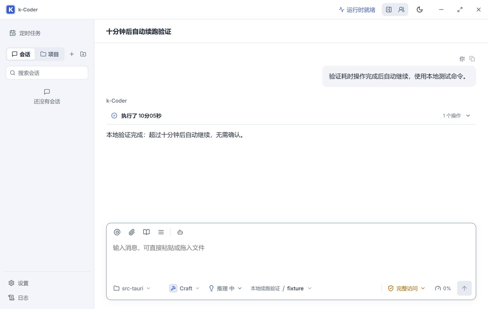

# 推送执行收敛与续跑修复验证

日期：2026-09-15。路线图任务：P10-183。

## 原因

项目“推送代码”会话 `291b3343-e7fe-49a0-8535-0248e2e9c441` 于 2026-09-14 23:27:41 开始，在 23:38:24 因本段运行 644 秒超过默认 600 秒而请求继续，23:43:13 才收到继续操作。触发时仅 21 次 Provider 请求、599,384 累计 Token，未达到另外两项软门。48 条审批全部自动通过，实际等待为 4 分 49 秒。

该会话还创建了两个预算不足而失败的子任务，共调用 89 次工具、其中 71 次命令，重复盘点 Git 状态和文件。两次推送本身约 6.5 秒和 4.1 秒。最后的答复只列成功检查，未披露本轮测试失败。

## 修改

- `SoftTurnLimits.duration_ms` 改为 `Option<u64>`，默认 `None`；达到 100 次 Provider 请求或 5,000,000 累计 Token 仍在安全边界请求继续。耗时继续记录展示，但默认提示不再宣称下一段有 600 秒时间额度。
- 时间门判断继续支持明确的有限值；Goal/子智能体显式预算、命令超时、取消、工作区隔离、审批与无进展检测保持原边界。
- 原生验收发现 `run_command` 的公开 `timeoutMs` 未映射到处理器的 `timeout_ms`，导致 660 秒参数被忽略而在默认 120 秒超时。增加明确的 serde 重命名和旧拼写别名，默认值、Schema 范围和执行层上限继续保留。新增真实进程超时和参数规范化回归，修改前均按预期失败。
- 项目执行指引放在 `agent/instructions.rs`，经共有 System Prompt 入口送达首次启动和重试；无项目会话不接收此指引。要求简单任务直接完成，只在减少总工作量时委派，复用观察结果，按变化定向复查，推送仅按授权范围推进并核验一次结果。
- 最终报告要求披露失败、未执行和已知遗留检查；不能用专项通过代替全量通过。创建子智能体的工具说明也同步强调简单提交、推送、状态查询和小修改默认直接完成。
- 不改变持久化事件或 IPC Schema，不改写旧会话，不自动回答既有等待中的续跑卡片。

## 自动验证

先增加回归测试并运行，观察到两项预期失败：600,000 毫秒触发默认暂停，默认续跑提示仍包含时间额度。实施修改后续跑专项 9/9 通过，包括默认时长边界、100 次请求、500 万 Token、继续、压缩后继续、停止，以及 Goal 适用范围。

| 命令 | 结果 |
| --- | --- |
| `pnpm build` | 通过，保留已有大 bundle 警告 |
| `cargo fmt --manifest-path src-tauri/Cargo.toml -- --check` | 通过 |
| `cargo check --manifest-path src-tauri/Cargo.toml` | 通过 |
| `cargo test --manifest-path src-tauri/Cargo.toml soft_turn -- --test-threads=1` | 9/9 通过 |
| `cargo test --manifest-path src-tauri/Cargo.toml` | 551 通过、3 个既有失败；含新增 4 项回归及更新后的启动/重试契约 |
| `node --check scripts/validate-turn-flow-native.cjs` | 通过 |
| `node scripts/validate-turn-flow-native.cjs` | 通过：真实间隔 605,871 毫秒、两次 Provider 请求、0 个续跑请求，刷新恢复通过 |

更新了真实 HTTP Provider 请求的重试契约回归，验证直接重试与 mailbox 重试收到完整项目指引，无项目会话不注入。全量测试覆盖显式预算停止、取消和进程树清理；三个失败与 P10-182 及此次修改前记录一致，均位于未改动的读取收敛逻辑：

- `agent::tests::read_recovery_delivery_only_hard_stops_the_corrected_provider_batch`
- `agent::tests::recovery_still_stops_varied_overlapping_reads_after_one_correction`
- `agent::tests::semantic_read_tracker_recovers_once_before_stopping_overlap_loops`

这些失败仍未解决，不把本轮结果描述为全量通过。代码只读审查未发现新增功能或安全回归。

## 原生验收

实际启动 `pnpm tauri dev --no-watch --config .tmp-ui/turn-flow/tauri.conf.json`，独立应用标识 `com.kcoder.validation.turnflow`，Vite 1492，WebView2 CDP 9432。脚本初始切换到 `.tmp-ui/turn-flow/workspace`；刷新后的应用初始化恢复了开发宿主目录，最终会话绑定路径经 JSONL 核对为 `D:\code\k-coder\src-tauri`。本地 Provider 唯一工具命令仅执行 `Start-Sleep` 与固定 `Write-Output`，不读取、修改、提交或推送该目录内容；真实会话与供应商配置保持隔离。

本地 HTTP/SSE Provider 首次请求返回一个运行 605 秒的命令，命令完成后必须自行进入第二次请求并完成 Turn。脚本检查项目指引到达、第二次请求收到命令结果、两次请求间隔超过 600 秒、无续跑交互、完成状态与刷新恢复。使用本机固定响应和假凭据，不调用外部模型、不执行 Git 提交或推送。

第二次验收会话 `a838f6a5-e849-4972-85b3-79960f40ad99` 通过：两次 Provider 请求相隔 605,871 毫秒，命令结果正常回传，Turn 完成且持久化 `userInputs` 为空；刷新后状态和最终正文仍可见。截图 `turn-flow-native.png` 已目视确认执行时长为 10 分 05 秒，无确认卡片。脚本清理测试 Provider 与假凭据；隔离开发实例已关闭。

首次尝试会话 `ca86a583-4dde-4f0b-8039-4f8fa249cb92` 在约 121 秒命令超时，暴露上述参数映射错误，未计为通过。修复后重新构建并启动隔离实例；验证脚本同步增加终态/续跑请求快速失败，避免已有失败后仍等待整个验收截止时间。

## 限制与部署

取消默认墙钟暂停属于确定性运行时修复；精简任务流程属于模型指引，只能验证指引已传递，不能保证任意真实模型都遵从。本次没有基于真实外部模型做行为评测。

源码修改仅在 `D:\code\k-coder\`。未提交、未推送、未部署到 `D:\apps\k-coder\`。现有正式进程实际运行于 `E:\Program Files\k-coder\k-coder.exe`，本轮未修改或重启它；加载新构建后才会使用修复。原有已暂停的会话不会被后台自动恢复。
