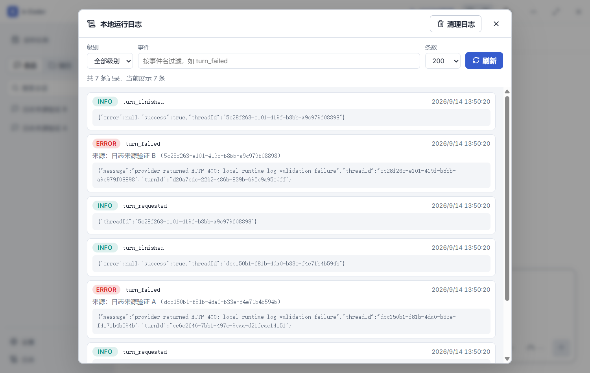

# 本地运行日志优化验证

日期：2026-09-14。路线图任务：P10-173。

## 实现行为

- 新日志仅接受 Info、Error（大小写归一化）；查询旧文件时也排除 Trace、Debug、Warn，级别选择器仅提供全部、Info、Error。旧文件不在升级时自动重写，由用户使用清理入口主动清理。
- 知识库失败、失败的 embedding 批次和引用拒绝归为 Error；正常取消归为 Info，避免原先 Warn 的重要失败随过滤丢失。引用拒绝携带宿主调用的 threadId、turnId。
- 每条 Error 独立展示“来源：对话名称（对话 ID）”，按日志的原始 threadId 从 Repository 查询名称。已删除、归档或元数据不可用时保留 ID 并标注名称不可用；没有关联 ID 时显示“应用运行时（无关联对话）”。查询包含子智能体线程，不采用侧栏过滤后的会话集合。来源名称只在查询时添加，不复制进日志文件。
- 修正 Rust LogRecord 的 IPC 序列化，时间字段输出 timestampMs，与前端一致；兼容旧 timestamp_ms 反序列化。
- 日志窗口右上角增加“清理日志”。界面内说明清理不受筛选条件限制，用户可以取消或确认。后台要求 confirmed=true；固定操作 runtime.jsonl 和 runtime.jsonl.1～3，不接受模型参数或任意路径，不影响对话历史、工具事实事件和其他文件。
- 清理与读取、追加、轮转共用互斥锁，先预检所有固定路径，拒绝符号链接、Windows reparse point/目录联接和异常文件类型；完成后生成一条 Info 的 logs_cleared 审计记录，后续日志继续追加。清理失败显示错误并允许重试。

## 自动回归

新增 Rust 回归覆盖级别写入与旧记录过滤、密钥脱敏、时间和来源字段契约、筛选和条数上限、确认缺失拒绝、全部轮转清理、无关文件/对话保留、审计记录、并发写入与清理、目录联接逃逸拒绝、异常轮转文件导致预检失败，以及两个对话/已删除来源/应用级来源的关联。

新增 Playwright 桌面与窄屏回归覆盖来源显示、仅两类级别、取消与确认清理、筛选条件下全量清理、审计记录显示、失败保留列表和重试，共 4 项通过。原有侧栏在窄屏隐藏，测试先在桌面打开日志窗口，再恢复 700px 宽度验证窗口本身。

| 验证 | 结果 |
| --- | --- |
| pnpm build | 通过；保留既有大 chunk 提示 |
| cargo fmt --manifest-path src-tauri/Cargo.toml -- --check | 通过 |
| cargo check --manifest-path src-tauri/Cargo.toml | 通过 |
| cargo test --manifest-path src-tauri/Cargo.toml | 536 通过、3 失败；失败均为原有 agent/mod.rs 读取收敛改动对应旧断言 |
| 日志专项 E2E | 4/4 通过 |
| 全量 E2E | 216 项：199 通过、8 跳过、9 失败；其中 8 项与既有记录一致，另 1 项浏览器场景超时定向复跑通过 |
| 真实 pnpm tauri dev 原生链路 | 通过 |
| git diff --check | 通过 |

## 原生桌面验证

启动 `pnpm tauri dev --no-watch --config src-tauri/target/log-validation.json`，隔离应用标识为 com.kcoder.validation.logs，Vite 端口 1476，WebView2 CDP 端口 9416。

使用 `scripts/validate-logs-native.cjs` 的本地 HTTP 400 Provider 触发两个真实对话错误，验证对话名称与各自 ID 一致、时间可读、下拉级别准确；加入三代轮转夹具并确认 Warn 不展示。取消清理保留文件，确认清理后只剩 runtime.jsonl 中的一条 logs_cleared，两个对话消息仍可读取，再运行一个失败 Turn 后正确显示新 Error 与来源。未调用外部模型。

原生截图：



## 工作区与部署

本次只修改源码仓库，未提交或推送代码，未部署到 `D:\apps\k-coder\`。工作区原先已有 AGENTS.md 与 src-tauri/src/agent/mod.rs 修改，予以保留；agent/mod.rs 的读取收敛宽限改动使三项旧断言不再匹配，本次未更改该逻辑。


Rust 全量中保留的三个失败：

- agent::tests::read_recovery_delivery_only_hard_stops_the_corrected_provider_batch
- agent::tests::semantic_read_tracker_recovers_once_before_stopping_overlap_loops
- agent::tests::recovery_still_stops_varied_overlapping_reads_after_one_correction

原生验证结束后已停止本次隔离开发客户端，正式安装端进程未操作。隔离运行数据保留在专用应用标识目录，未清理真实用户日志。

复现原生验证所需配置（写入 src-tauri/target/log-validation.json）：

```json
{"identifier":"com.kcoder.validation.logs","build":{"beforeDevCommand":"pnpm dev --host 127.0.0.1 --port 1476","devUrl":"http://127.0.0.1:1476"}}
```

```powershell
$env:WEBVIEW2_ADDITIONAL_BROWSER_ARGUMENTS='--remote-debugging-port=9416'
pnpm tauri dev --no-watch --config src-tauri/target/log-validation.json
# 等待原生客户端就绪后，在另一终端执行：
node scripts/validate-logs-native.cjs
```


全量 E2E 中的 8 项既有失败与《深色主题样式对齐验证》记录一致：欢迎页、Skill 首候选、记忆设置入口、恢复历史执行块，各包含 desktop/narrow 两个项目。本次额外失败为 narrow 的 `bounds divider dragging across an iframe and releases capture on cancellation`，等待浏览器地址输入框超时，发生在拖动与日志窗口操作之前。

额外浏览器超时在完整测试结束后，使用 `pnpm exec playwright test e2e/workbench.spec.ts --grep "bounds divider dragging across an iframe" --project narrow` 单独复跑，1/1 通过（场景耗时 1.8 秒），未修改该场景的代码或断言。
