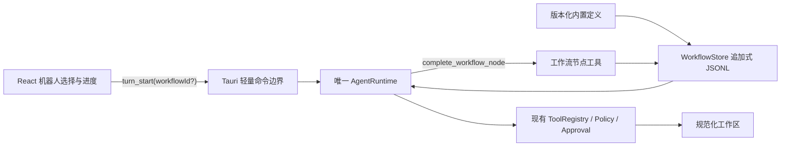
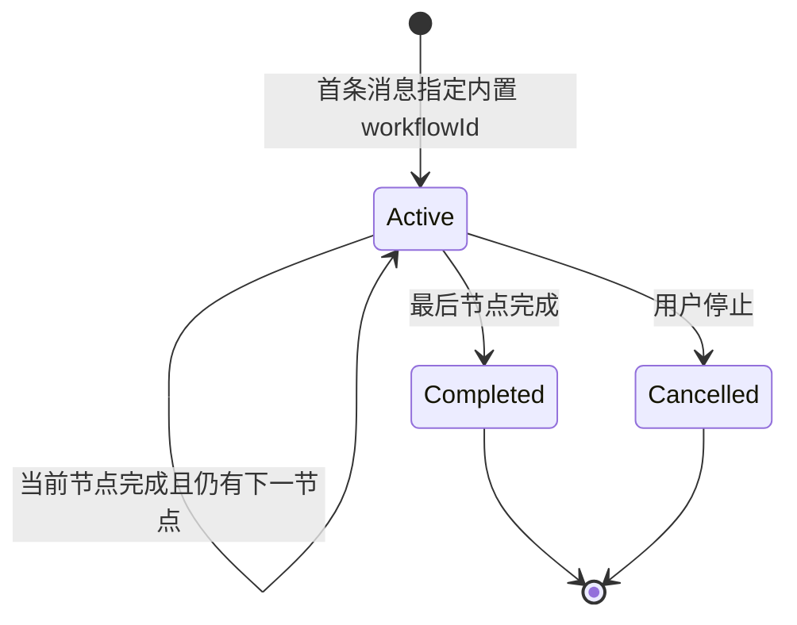

# 机器人工作流设计

## 1. 目标

在不复制第二套智能体循环的前提下，为 k-Coder 提供可选择、可恢复、可审计的内置机器人工作流。机器人负责限定角色和执行阶段，实际模型调用、工具执行、审批、工作区校验、取消与持久化仍由现有 `AgentRuntime` 完成。

原始工作流对应用户优先插入任务 `P10-116`；本次 `P10-151` 在此基础上补齐节点 Skill 绑定、受管机器人包、插件回退与分类界面，交付三个内置机器人：

| ID | 名称 | 节点 |
| --- | --- | --- |
| `fullstack-delivery` | 全栈开发机器人 | 23 个技能声明，8 个节点：需求理解、界面与架构、原型 HTML、后端、前端、全面测试、构建发布、代码审查与交付 |
| `quality-assurance` | 软件测试机器人 | 16 个技能声明，7 个节点：测试策略、用例设计、单元、集成/API、E2E/UI、非功能、测试报告与交付 |
| `requirements-design` | 需求设计机器人 | 9 个技能声明，7 个节点：需求采集、业务边界、用户故事、交互流程、PRD 审查、文档输出、钉钉发布 |

## 2. 范围

### 本次交付

- 后端持有版本化内置工作流定义，前端只消费投影，不解释或执行工作流。
- 首条消息携带可选 `workflowId`，线程空闲时由后端原子创建运行实例，并把该消息作为目标。
- 每个 Turn 注入完整角色约束、目标、全部节点摘要和当前节点指令。
- 启动、恢复和每次 Provider 请求前都对整个工作流做 Skill 预检；当前节点的 Skill 正文按请求动态编译，不落盘。
- 机器人包中的本地 Skill 始终启用且不能在设置中关闭；插件 Skill 可选，缺失、停用或超限时自动使用明确的内置兼容 Skill。
- 模型只能调用 `complete_workflow_node`，提交当前节点 ID、总结和有界证据后推进。
- 工作流运行状态以追加式 JSONL 快照持久化，切换线程或重启后恢复。
- 输入区提供机器人选择，活动运行显示节点进度并允许用户停止。
- 独立会话禁止启动项目机器人；Craft、Ask、Plan 和工具策略继续由主运行时执行。

### 暂不交付

- 用户自定义工作流文件、在线编辑、拖拽编排、条件分支和并行节点。
- 工作流不自动启用普通 Skill、插件、MCP、Hook 或子智能体；机器人包 Skill 是随应用发布的受管内置契约。
- 节点完成后自动调用钉钉、禅道、Git push 等外部副作用。
- 根据自然语言标记或普通回复自动推进节点。

## 3. 架构

职责边界：

- `advanced/workflow.rs`：定义、状态机、持久化和节点工具。
- `commands/mod.rs`：校验线程类型并暴露列表、读取、停止命令；不执行智能体循环。
- `agent/`：保持唯一 Turn 循环，只接收组合后的运行时指令。
- `tools/` 与 `policy/`：继续决定文件、Shell、浏览器、MCP 等工具行为和授权。
- `src/`：展示定义和运行投影，不自行推进节点。

## 4. 数据契约

### 定义

`WorkflowDefinitionView` 包含：

- `schemaVersion`
- `id`、`name`、`description`
- `localSkillCount`、`pluginSkillCount`、`uniqueSkillCount`、`skillCatalog[]`
- `nodes[]`：`id`、`title`、`description`、声明计数及本地/插件绑定

`get_workflow_skill_readiness` 返回每个声明的解析来源、正文哈希/字节数、节点唯一正文数量和阻断原因；不返回正文。

定义编译进应用，ID 和节点 ID 使用小写 kebab-case，启动时通过单元测试校验唯一性、非空字段和节点数量边界。角色正文与节点执行指令只保留在后端，避免前端成为提示词事实来源。

### 运行实例

`WorkflowRunView` 包含：

- `id`、`threadId`、`workflowId`、`objective`
- `state`：`active`、`completed` 或 `cancelled`
- `currentNodeId`、`currentNodeIndex`、`nodeCount`
- `completedNodes[]`：节点 ID、总结、证据、完成时间
- `createdAtMs`、`updatedAtMs`、`revision`

状态文件位于应用数据目录 `runtime-data/advanced/workflows.jsonl`。每次状态变化追加完整、有界快照，不原地覆盖历史记录；读取时按运行 ID 选择最高 revision，再取线程最近实例。

## 5. 状态机

推进约束：

1. 一个线程最多有一个 `active` 运行实例。
2. `complete_workflow_node` 必须命中调用线程的活动实例和当前节点。
3. 总结必须非空，证据为 1 到 8 条非空文本；单条和总载荷均有上限。
4. 后续节点只由后端定义决定，模型不能传入索引、下一个节点或权限字段。
5. 完成最后节点后运行实例不可再次转换；新请求可显式启动新的实例。

## 6. Prompt 组合

工作流指令作为受控运行时层加入现有 system prompt，优先级低于宿主安全和模式约束，高于普通用户文本。每个外层 Provider 请求都重新从 `WorkflowStore` 读取状态并编译当前节点 Skill；瞬时重试复用同一请求快照，不复用前端缓存。

指令包含：

- 实际注入的角色职责，而不是仅保存元数据。
- 原始目标和工作流节点列表。
- 唯一当前节点、执行要求和完成标准。
- 当前节点绑定 Skill 的原始声明、实际来源、哈希、字节数和去重后的正文。
- 必须使用 `complete_workflow_node` 提交证据；普通文本或特殊标记不能推进。
- 工具权限、审批和工作区边界不因机器人而改变。

工具成功结果返回下一节点的标题和指令，因此同一 Turn 可以在宿主允许时继续；Turn 结束后也可由下一条用户消息恢复。

## 7. 安全与失败处理

- 仅接受精确匹配的内置 workflow ID，不读取模型提供的路径或任意定义正文。
- 独立会话没有项目工作区，后端拒绝启动机器人；前端禁用入口只是辅助。
- 工作流不声明工具 Capability，也不自动启用普通 Skill、插件、MCP、Hook 或子智能体；受管机器人 Skill 不受普通启用开关影响。
- 文件和 Shell 操作仍经过规范路径、工作区逃逸检查、Policy、审批、超时、取消和进程树清理。
- 状态文件解析失败、未知定义、错误节点、空证据、过大载荷和终态重复推进全部关闭失败。
- 工作流目标、总结和证据不记录凭据、请求头或完整环境变量；现有工具脱敏边界继续适用。

## 8. 界面

- 输入区使用机器人图标菜单展示“普通智能体”和三个内置机器人。
- 选择机器人时切换到 Craft；真正运行在下一次发送被后端接纳后开始。
- 活动运行在输入区上方显示名称、当前节点、`X / N` 和进度条。
- 活动 Turn 中不允许停止或切换机器人；线程空闲后可用停止按钮终止运行。
- 设置页“机器人”展示内置定义及节点序列；“Workflows”继续保留为后续可视化编排入口。
- 设置页“Skills”按固定职责分类、搜索和来源筛选；机器人包 Skill 显示“机器人必需”并隐藏禁用开关。机器人详情展示本地/插件声明、插件 fallback 状态和当前节点绑定。

## 9. 验收

- 定义校验、23/16/9 声明和 8/7/7 节点计数、重复启动、错误节点、证据边界、逐节点推进、最终完成和取消均有 Rust 测试。
- 覆盖机器人包强制启用与同名全局/项目 Skill 不可覆盖、插件 fallback、完整预检、正文哈希去重、当前节点切换和正文不落盘。
- `run_turn` / `turn_start` 的顶层参数、mailbox 快照和 TypeScript API 使用可选 `workflowId`，保持旧调用与旧快照向后兼容。
- 前端 E2E 覆盖项目线程选择、首条消息携带 ID、进度恢复、独立会话禁用和停止。
- 执行路线图规定的前端构建、Rust 格式/检查/全量测试，并通过隔离配置实际启动 `pnpm tauri dev` 验证桌面路径。

## 10. 节点技能绑定与技能入库（ADR 0055）

- 工作流节点定义支持本地 `Skill` 和插件 `PluginSkill` 两类声明；节点激活时宿主读取当前节点绑定的 SKILL.md 正文，以受控运行时区块注入，每节点最多 24 个声明、24 个去重正文、单正文 16 KiB、合计 128 KiB。
- 机器人包本地 Skill 强制启用；插件 Skill 优先使用已启用插件，缺失、停用或超限时回退到声明的机器人包 Skill。没有可用 fallback 的插件声明才阻断预检。
- 正文只存在于瞬时 Provider 请求，JSONL、界面和日志只保留声明、来源、哈希和字节数；`complete_workflow_node` 仍是唯一推进方式。
- 从 cn-codex 复制的技能统一放 `src/resources/skills/robot-pack/` 分组目录，`discover_skills` 支持一级分组；绑定表、技能正文准入判据（正文引用的工具必须存在于 k-Coder 注册表）与技能生产计划（`webapp-testing` 重写 + 浏览器控制台捕获增强等）见 ADR 0055。
- 界面：设置页机器人展示每节点绑定技能；运行进度展示当前节点已注入技能列表。
