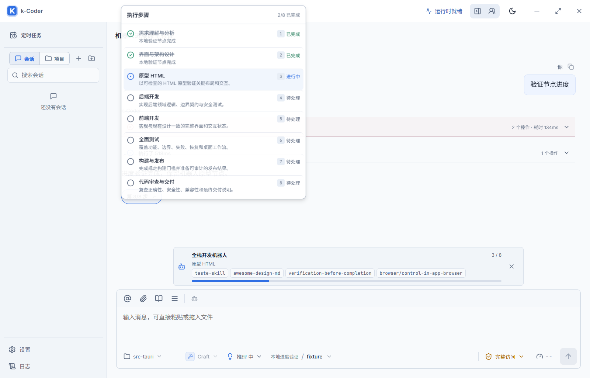

# 机器人进度一致性验证

- 日期：2026-09-10
- 路线图：P10-165
- 决策：ADR 0039 的进度展示补充

## 现场原因

正式程序为 `D:\apps\k-coder\k-coder.exe`。全栈机器人会话 `583d9226-b229-41b0-9138-39c702558f19` 的工作流已完成需求分析和界面架构设计，`workflows.jsonl` revision 3 的当前节点是 `html-prototype`（索引 2）。同会话的 `plans.jsonl` 只有 revision 1，第一步仍为 `in_progress`。原对话胶囊读取后者，输入区机器人卡片读取前者，导致 1/8 与 3/8 并存。

## 修复

`src/lib/workflowProgress.ts` 从当前线程工作流和版本匹配的定义生成只读步骤投影；已完成节点读取持久化完成记录，当前步骤读取节点 ID。`App.tsx` 在机器人会话使用该投影，普通会话继续使用独立计划。重试活动期间将胶囊附着当前 Turn，静止时关联最近成功的节点完成调用，避免在旧尝试下继续展示旧计划。

不修改正式用户数据、机器人状态、工具结果或 Provider 历史。未知定义、跨线程、版本不匹配和节点数量不符时不猜测步骤；取消仅保留已完成事实，不伪造全部完成。

## 验证结果

| 检查 | 结果 |
| --- | --- |
| `pnpm build` | 通过；保留既有大产物提示 |
| `cargo fmt --manifest-path src-tauri/Cargo.toml -- --check` | 通过 |
| `cargo check --manifest-path src-tauri/Cargo.toml` | 通过 |
| `cargo test --manifest-path src-tauri/Cargo.toml` | 519/519 通过 |
| 工作流投影、机器人恢复/实时推进/失败/刷新、普通计划专项 | desktop/narrow 合计 10/10 通过 |
| `node scripts/validate-workflow-progress-native.cjs` | PASS |
| 额外综合工作台测试 | 计划胶囊、详情、文件统计检查通过；两视口均在 Skills 页 `Built-in workspace review` 旧文案断言失败，不属于本次进度修复 |

专项命令：

```powershell
pnpm test:e2e e2e/workflow-progress.spec.ts e2e/workbench.spec.ts --grep 'workflow projection|robot progress|restores persisted robot|ordinary conversation keeps'
```

综合测试原先对步骤状态使用精确文本查询，但状态容器现有序号会使文本为“1已完成”；本次将两项断言改为状态容器内包含文案，仍验证正确的步骤状态。后续 Skills 页失败单独保留，未借此修改无关产品行为。

## 原生桌面路径

实际启动 `pnpm tauri dev --no-watch --config C:/Users/nealk/AppData/Local/Temp/kcoder-workflow-progress-tauri.json`，使用独立标识 `com.kcoder.validation.workflowprogress`、Vite 1455、WebView2 CDP 9395。本地确定性 SSE 服务替代外部模型，实际运行 IPC、工具、AgentRuntime、工作流持久化及 WebView。

1. 创建八步普通计划，只将第一步标为进行中。
2. 真实调用 `complete_workflow_node` 完成需求节点。
3. 下一次响应返回 `length` 失败，进度显示第 2/8 步。
4. 刷新恢复后展开失败过程，通过界面点击“重试”。
5. 重试实际完成设计节点，原型请求保持活动；两处均显示第 3 步，全页只有一个胶囊。
6. 展开详情，前两个节点已完成、原型 HTML 进行中。
7. 返回本轮回复并刷新；再次验证 3/8 和步骤详情。
8. 通过真实查询确认普通计划仍是第一步进行中，工作流为索引 2，证明显示不依赖模型补调 `update_plan`。

测试假凭据和供应商配置在 finally 清理。原生测试过程中发现失败阶段正文增量不会在刷新后恢复，因此脚本等待持久化进度和失败摘要，并先展开已收起的失败过程再点击重试。



代码停留在工作区，未 commit、push，也未替换 `D:\apps\k-coder` 中的正式程序。
