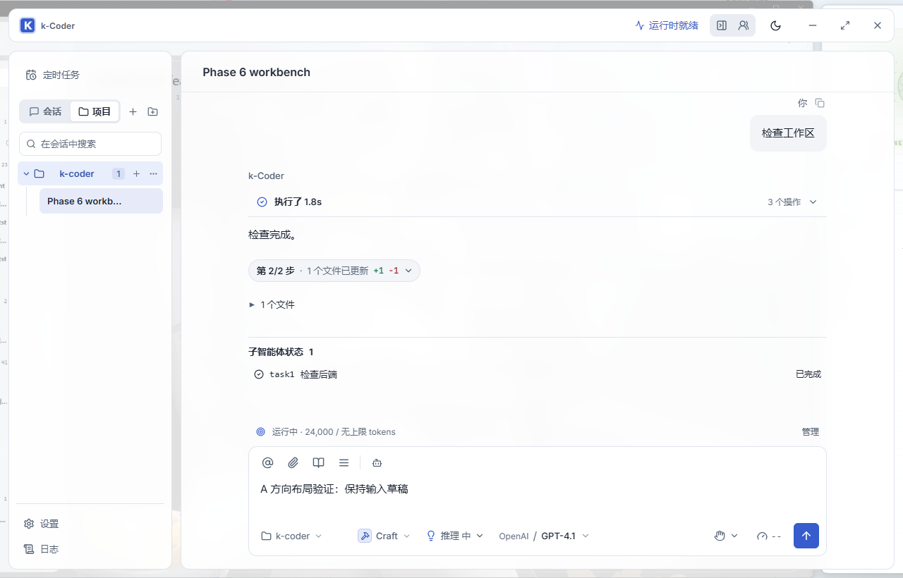
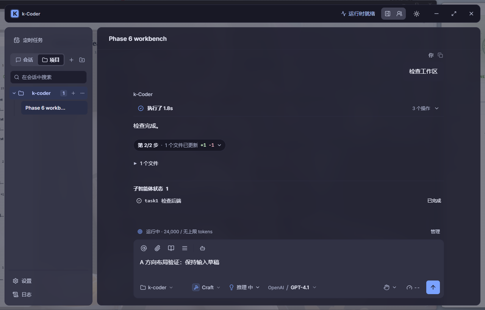
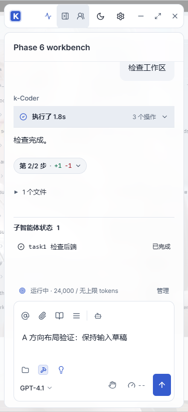

# 界面阅读层级优化验证

- 日期：2026-09-15。
- 路线图：用户优先插入 P10-187。
- 实际源码目录：`D:\code\Nick\k-coder`。
- 使用 UI UX Pro Max 的可读性、对比度和 React 布局指引，在既有主题与卡片布局上优化。

## 改动

聊天区背景底色从 28% 提高到 88%，并对其背后的图片做 12px 模糊，避免人物和图片中的文字穿透正文；侧栏使用 92% 底色和 8px 背景模糊。窗口背景遮罩改用当前主题的 surface 色，深色主题不再叠加白色蒙层。输入框采用实色，取消常态大阴影，聚焦时保留主题色边框和焦点环。

正文、Goal 栏和输入框共享最大 820px 的阅读宽度，按会话列宽计算边距；消息滚动区域预留对称滚动条空间，保持左右对齐，并与输入区分开占据网格行。空输入框在常规桌面尺寸下约 156px 高，文本区域最小 64px，通过 CSS field-sizing 随内容增高，最高为 240px 与 28vh 中的较小值，超过上限在输入框内部滚动。窄屏允许底部控件换行，高度会相应增加。

输入区优先给模型名称分配空间，会话列小于等于 960px 时隐藏次要供应商前缀；完整供应商、模型显示名与 ID 可通过悬停提示和模型菜单查看。权限选择、用量、发送和停止操作继续可见。当前会话使用浅主题色底和较深加粗文字，并提供 aria-current 与键盘焦点样式。

仅修改展示层，没有修改运行时、工具、授权或 IPC 契约；保留开始前已有的卡片、背景预览及其他工作区修改。field-sizing 依赖现代 Chromium/WebView2；旧版不支持时仍保留 textarea 的 rows 与高度边界，但自动增高效果需要在实际 WebView2 补验。

## 验证结果

| 检查 | 结果 |
| --- | --- |
| pnpm build | 通过；保留既有大 chunk 提示 |
| cargo fmt --manifest-path src-tauri/Cargo.toml -- --check | 通过 |
| cargo check --manifest-path src-tauri/Cargo.toml | 通过 |
| cargo test --manifest-path src-tauri/Cargo.toml | 553 通过，3 个既有读取收敛失败 |
| Playwright 界面与交互专项 | 12 项通过，使用系统 Edge 和 Vite 1495 |
| 原生桌面 | 已尝试 pnpm tauri dev，因运行中的开发版占用 exe 而阻塞，尚未完成 |

专项覆盖模式浮层、面板拖动与宽度恢复、打开工作台后无横向溢出、模型切换、权限选择，以及浅色/深色 × 背景开/关的阅读布局。更新的阅读测试检查多行草稿增高、上限内滚动、短草稿收回、1280/1024/853/375px 下正文与输入框两侧偏差不超过 1px、消息区不覆盖输入区、选中会话语义。浅色、深色与窄屏截图已目视核对。

最初新增的选中态断言失败，是因为测试停留在不包含项目会话的“会话”标签；切到“项目”并展开项目后通过。没有改变产品的会话分组规则。

Rust 失败与先前 P10-186 文档一致：

- `agent::tests::read_recovery_delivery_only_hard_stops_the_corrected_provider_batch`
- `agent::tests::recovery_still_stops_varied_overlapping_reads_after_one_correction`
- `agent::tests::semantic_read_tracker_recovers_once_before_stopping_overlap_loops`

原生尝试命令：`pnpm tauri dev --no-watch --config src-tauri/target/card-layout-validation.json`，独立标识 `com.kcoder.validation.cardlayout`、Vite 1459、CDP 9399。Cargo 在替换 `src-tauri/target/debug/k-coder.exe` 时返回 Windows 拒绝访问（os error 5）；已有 PID 10336 使用同一路径。没有终止用户现有客户端。验证启动已退出，没有遗留本次的 1459/9399 监听。

原生补验项：实际 WebView2 的背景模糊、输入框自适应、模型/权限菜单、面板缩放与发送按钮可达性。当前截图来自带模拟 IPC 数据的浏览器验证，不能当作原生或真实模型链路验收。未部署到 `D:\apps\k-coder`，未提交或推送。

## 截图

