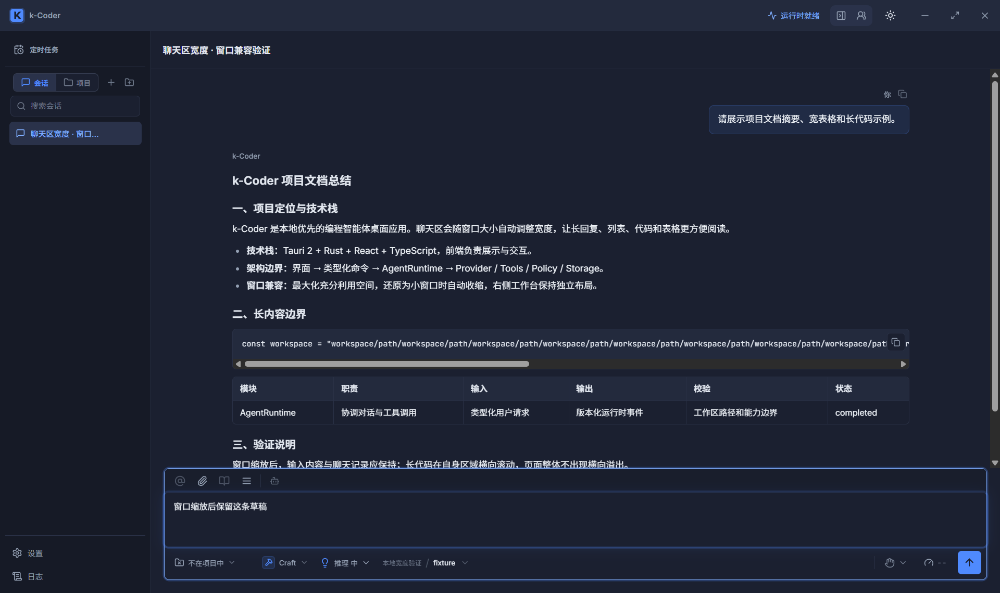
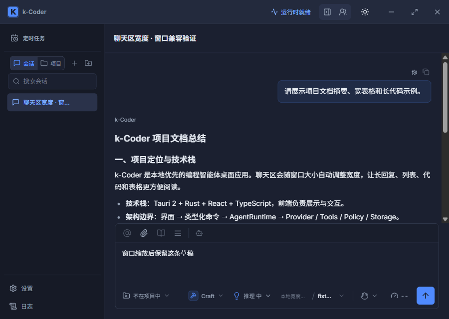

# 聊天区宽度优化验证

- 日期：2026-09-10
- 路线图：P10-164（用户优先插入）
- 需求：拓宽聊天消息区，兼容客户端最大化、小窗口和最小化后恢复。

## 设计与改动

使用 Impeccable 的产品 UI 指引，以现有深色主题、字号、组件和响应式结构为基础。用户明确要求拓宽技术回复，采用有上限的居中内容列，避免大屏无限拉长正文。

`src/App.css` 中仅调整消息布局：

- `.message-list` 的宽度由 `min(100%, 820px)` 改为 `min(100%, 1040px)`，上限增加约 26.8%。
- `.message-area--populated` 的水平边距由 `clamp(20px, 5vw, 64px)` 改为 `clamp(18px, 3%, 40px)`。百分比相对聊天所在列，右侧面板展开时也会收缩。
- 复用现有 720px 以下的 18px 边距、可收缩容器、代码和表格内部滚动规则。无公共协议、权限或运行时行为变更。

## 验证结果

| 检查 | 结果 |
| --- | --- |
| `pnpm build` | 通过；保留现有大 chunk 提示 |
| `cargo fmt --manifest-path src-tauri/Cargo.toml -- --check` | 最终通过；首轮其他正在修改的 Rust 文件有格式差异，本任务没有修改这些文件 |
| `cargo check --manifest-path src-tauri/Cargo.toml` | 通过 |
| `cargo test --manifest-path src-tauri/Cargo.toml` | 514 passed |
| 现有 Playwright 消息、Markdown、工作台布局专项 | desktop/narrow 共 6 passed，使用系统 Edge |
| `git diff --check` | 通过 |

Playwright 专项使用 `e2e/workbench.spec.ts` 中的 `renders streamed assistant markdown`、`keeps the mid-width workbench` 和 `keeps messages, composer` 三组用例。本次为局部 CSS 调整，复用既有回归，并通过真实 WebView 做额外尺寸断言，没有增加镜像实现的样式单测。

## 原生客户端与视口验证

实际启动 `pnpm tauri dev --no-watch --config <临时配置>`：标识 `com.kcoder.validation.chatwidth`，Vite 1453，WebView2 调试端口 9392。通过真实 IPC 创建隔离会话、配置本机 SSE 假模型，在界面发送请求得到中文摘要、长代码、六列表格；不调用外部模型。

真实窗口按钮完成最大化（1536 CSS px）、还原（1200 CSS px）、最小化，再通过桌面窗口激活恢复。回复完成后填入的草稿在以上操作及后续所有视口切换中保留。最大化消息列实测为 1040px，1200px 还原窗口约为 895px。

在同一真实 WebView 上使用 CDP 视口模拟补充检查 900×640、1097×820、1280×820、1920×1080、2560×1440、700×820、375×820，并返回 1200×760。900px 对应应用声明的最小窗口宽度；375/700px 是额外响应式检查，不代表应用原生允许缩小到该尺寸。900px 稳定布局的消息列约为 633px。

右侧工作台展开时另外检查 900、1097、1536px：900px 时聊天列为 580px、正文约 529px，发送按钮仍在输入区内，工作台与聊天列不重叠。全部视口的消息滚动区和输入区 `scrollWidth - clientWidth` 均为 0；长代码和宽表格只在各自内部横向滚动。

修改保留在工作区，未提交、推送或部署正式安装包。共享工作区中的其他既有改动不属于本次聊天宽度调整。
