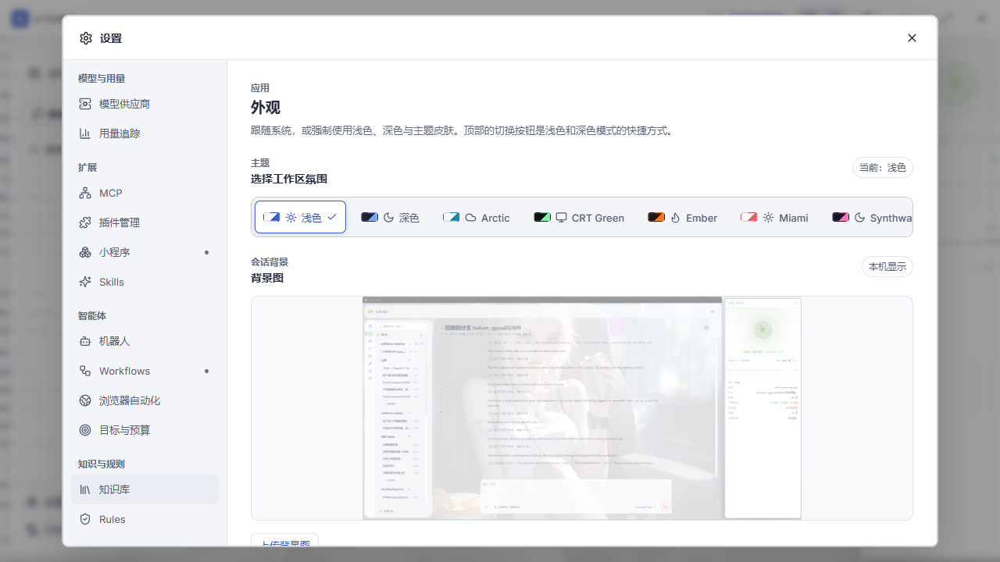

# 背景图预览放大验证

- 日期：2026-09-15
- 源码工作区：`D:\code\Nick\k-coder`
- 用户需求：外观设置中标出的背景图预览区域太小，图片显示不完整。

## 修改

仅修改 `src/App.css` 的背景图预览样式：高度从 112px 改为 `clamp(240px, 40vh, 420px)`；图片层采用 `contain`，居中且不重复，保留遮罩层；背景分区上方增加 24px 间距。没有公共协议或安全分支变动，无须新增契约测试。

按 impeccable 的 layout 流程运行独立布局评估与机械扫描两个子智能体；扫描前后均无规则告警。评估识别的预览过矮、裁图与分区间距问题已处理。现有标题/主题选择/预览/紧凑控件构成层级，12px 预览上下间距与 24px 分区间距区分组内和组间节奏；复用产品颜色令牌，不引入新卡片结构。

## 验证结果

| 检查 | 结果 |
| --- | --- |
| `pnpm build` | 通过，保留现有大 chunk 提示 |
| `cargo fmt --manifest-path src-tauri/Cargo.toml -- --check` | 通过 |
| `cargo check --manifest-path src-tauri/Cargo.toml` | 通过 |
| `cargo test --manifest-path src-tauri/Cargo.toml` | 553 通过、3 个既有读取收敛失败 |
| 现有外观主题选择和持久化 E2E | desktop/narrow 2/2 通过 |
| Edge 浏览器实际页面验证 | 四档尺寸通过，设置内容无横向溢出；下方可见度控件可滚动访问；400×800 竖图和 1200×400 横图上传及恢复内置背景通过 |
| 布局机械扫描 | 修改前后均为 `[]` |

| 视口 | 预览宽×高（CSS px） | 设置区横向溢出 |
| --- | --- | --- |
| 1420×810 | 848×324 | 0 |
| 900×640 | 588×256 | 0 |
| 700×820 | 668×328 | 0 |
| 1920×1080 | 848×420 | 0 |

浏览器复用 `e2e/workbench.spec.ts` 中的 Tauri 夹具，原生调用为模拟。一次性验证脚本与合成图片截图位于忽略的 `src-tauri/target/`，没有增加镜像实现的永久样式测试。已目视检查完整图片与竖图四边。

Rust 失败项与既有《Chat输出上限修复验证》记录一致：

- `agent::tests::read_recovery_delivery_only_hard_stops_the_corrected_provider_batch`
- `agent::tests::recovery_still_stops_varied_overlapping_reads_after_one_correction`
- `agent::tests::semantic_read_tracker_recovers_once_before_stopping_overlap_loops`

## 原生验证限制与部署

已执行 `pnpm tauri dev --no-watch --config src-tauri/target/background-preview-validation.json`，隔离标识 `com.kcoder.validation.backgroundpreview`，Vite 1516，WebView 调试端口 9456。构建无法替换被正在运行的开发版占用的 `src-tauri/target/debug/k-coder.exe`，报拒绝访问（os error 5）。未中断该既有进程，因此本次没有完成原生桌面交互验收。

修改保留在源码工作区，未提交、推送或部署到 `D:\apps\k-coder\`。工作区中的其他并行改动不属于本次预览放大。

