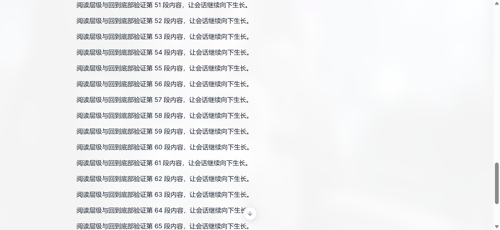
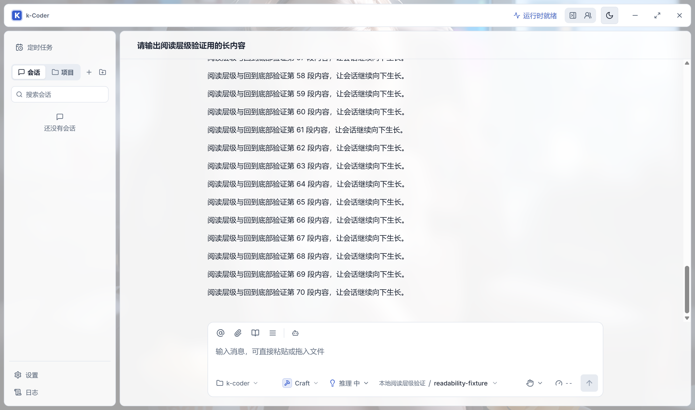
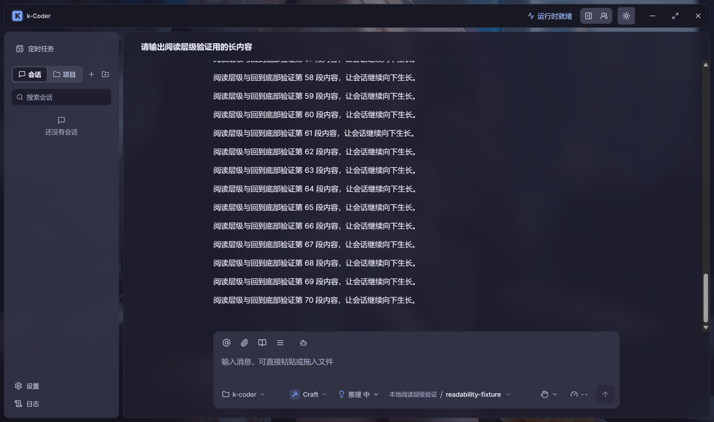

# 阅读层级与回到底部按钮原生验收

- 日期：2026-09-16。
- 路线图：用户优先插入 `P10-187`（界面阅读层级优化）与 `P10-189`（会话区「回到底部」悬浮按钮）。
- 补的是这两项此前一直空着的**原生桌面验收**（两者此前都停留在「浏览器专项通过、未启动 `pnpm tauri dev`」）。
- 说明：`P10-188`（手机局域网直连）的真机验收由用户自行执行，不在本文范围。

## 为什么需要原生补验

`P10-187` 与 `P10-189` 的既有结论全部来自 Playwright 浏览器专项，而浏览器专项有两点天然看不到：

1. **`field-sizing` 输入框自适应**依赖实际 WebView2（Chromium 版本），浏览器专项里 `rows` 与高度上限只能间接验证。
2. **背景模糊/遮罩**（`backdrop-filter` + `color-mix`）在真实合成器上是否生效，只能看真实窗口。
3. `P10-189` 的按钮几何此前只在浏览器里量过，没在真实窗口的缩放与滚动条环境下量过。

## 验证方式

隔离宿主，避免碰到用户真实数据（`DATABASE_SCHEMA_VERSION` 已升到 11，而用户库里是旧版本，用默认标识启动会迁移用户库）：

```powershell
$env:WEBVIEW2_ADDITIONAL_BROWSER_ARGUMENTS='--remote-debugging-port=9421'
pnpm tauri dev --no-watch --config src-tauri/target/readability-validation.json
# 另一个终端：
node scripts/validate-readability-native.cjs
```

- 独立标识 `com.kcoder.validation.readability`，Vite `1481`，WebView2 CDP `9421`，窗口 `1400×900`（`visible: false`；WebView2 仍正常渲染并可截图）。
- 新增 `scripts/validate-readability-native.cjs`：脚本内起一个 **loopback provider**（OpenAI Chat Completions 形状的 SSE，固定回复 70 段），通过页面里的 `src/api/runtime.ts` 切换工作区、写入该临时供应商并新建会话，因此拿到的是**真实长度的会话**，全程不调用外部模型、不消耗额度。

## 结果

### P10-189：会话区「回到底部」悬浮按钮

| 断言 | 实测 | 判据 |
| --- | --- | --- |
| 贴底时不渲染按钮与停靠点 | `0` / `0` | 两者 `count = 0` |
| 向上滚轮离开最新内容后出现 | 可见 | `toBeVisible` |
| 按钮贴住会话区底边的间距 | `16px` | 8 ~ 32px |
| 水平居中偏差 | `0px` | ≤ 2px |
| 停靠点高度（显隐不改变 `scrollHeight`） | `0px` | `= 0` |
| 按钮尺寸 | `32 × 32` | 32px 圆形 |
| 停靠点定位 | `sticky` | `position: sticky` |
| 触发时距底距离 | `241px` | > 48px |
| 点击后 | 距底 `≤ 2px`，按钮与停靠点均消失 | 回到最新且自动隐藏 |

### P10-187：界面阅读层级（浅/深 × 背景关闭/开启，共 4 组）

| 断言 | 实测（4 组一致） | 判据 |
| --- | --- | --- |
| 阅读列宽度 `.message-list` | `820px` | ≤ 820 且 ≥ 700 |
| 正文与输入区左右对齐 | `0px` / `0px` | ≤ 1px |
| 消息区与输入区不重叠 | `0px` | ≤ 1px |
| 输入区横向溢出 / 页面横向溢出 | `0` / `0` | ≤ 1px |
| 输入框常规高度 | `64px` | ≤ 70px |
| 输入框 18 行草稿 | 增高且 `scrollHeight > clientHeight` | 增高、≤ 240px、框内滚动 |
| 发送按钮可达 | 可见，距窗口底 `38px` | 在视口内且未被裁剪 |
| 模型触发器 `选择模型` 可见 | `true` | 可见 |
| 输入区可见操作（含权限、用量、发送） | `12` 个 | ≥ 3 |
| 背景开启时会话区 | `blur(12px)`，alpha `0.88` | 12px + 88% 遮罩 |
| 背景开启时侧栏 | `blur(8px)`，alpha `0.92` | 8px + 92% 遮罩 |
| 背景关闭时 | 无 `blur`，alpha `1`，且无 `workbench--background` | 遮罩与模糊全部退场 |

输入区可见操作实测清单（顺序即渲染顺序）：`引用工作区文件`、`添加附件`、`使用 Skill`、`更多操作`、`选择机器人`、`当前项目 k-coder`、`选择模式`、`选择推理强度`、`选择模型`、`操作批准方式：请求批准`、`上下文用量等待更新`、`发送消息`。

模型名在输入区完整显示为 `本地阅读层级验证 / readability-fixture`，与「优先给模型名称分配空间」的改动一致。

> `color-mix()` 在 Chromium 的 `getComputedStyle` 里被序列化成 `color(srgb r g b / a)` 而不是 `rgba()`，脚本的 alpha 解析同时处理两种形式——这是本轮实际踩到并修正的一个坑，若不处理会误报「遮罩完全不透明」。

## 截图







## 覆盖边界

- 内容来自 loopback provider，**没有**验证真实 Provider 的流式节奏与超长回复下的滚动表现。
- 窗口以 `visible: false` 启动（WebView2 仍渲染、可截图、可驱动），因此**没有**验证真实显示器上的目视观感与 Windows 缩放下的像素对齐；既有浏览器专项覆盖 1280/1024/853/375px 的几何断言。
- 未覆盖：面板拖动手感、审批交互、多显示器与高 DPI 环境。
- 本轮未部署到 `D:\apps\k-coder\`，未提交。
