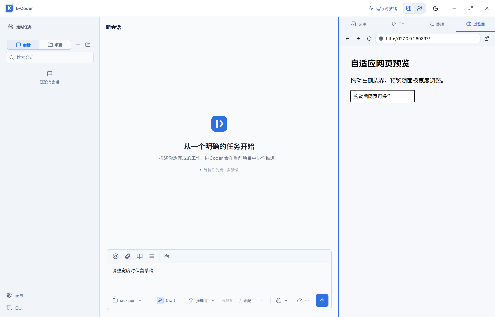

# 面板拖动与自适应宽度验证

- 日期：2026-09-10
- 路线图：P10-167，用户优先插入。
- 需求：截图所示左侧导航与会话、会话与右侧工作台的两条分隔线可拖动调整宽度，中间自动填充。

## 行为

分隔线有 8px 鼠标命中区域，悬停与键盘聚焦显示主题强调色。侧栏调整范围 200–400px，右侧工作台和子智能体共用 320–900px 范围，实际最大宽度同时受剩余会话空间限制。桌面会话至少保留 420px，中等窗口至少 360px。

默认宽度沿用原布局；调整后的宽度保存在版本化展示偏好 `kcoder_panel_widths_v1`，异常 JSON/类型/越界值回退默认。窗口缩小时只临时限制显示宽度，放大、关闭再打开面板、刷新后恢复偏好。1180px 以下展开右栏时隐藏左栏；720px 以下继续使用原窄屏面板视图并移除拖动手柄。

双击或 Enter 恢复默认；左右键每次微调 10px，Shift 加速至 40px，Home/End 定位当前允许的最小/最大值。Esc 取消当前拖动并恢复起始宽度，不触发全局关闭面板。Pointer capture 与低于模态层的拖动遮罩防止 iframe 抢走鼠标；松开、取消、窗口失焦/调整和组件卸载结束拖动。

实现位于 `src/hooks/usePanelWidths.ts`、`src/components/PanelResizeHandle.tsx`，由 `src/App.tsx` 接入现有根网格，CSS 使用计算后的宽度变量。只改变前端布局展示状态。

## 自动验证

| 检查 | 结果 |
| --- | --- |
| `pnpm build` | 通过；保留现有大 chunk 提示 |
| `cargo fmt --manifest-path src-tauri/Cargo.toml -- --check` | 通过 |
| `cargo check --manifest-path src-tauri/Cargo.toml` | 通过 |
| `cargo test --manifest-path src-tauri/Cargo.toml` | 525 passed，0 failed |
| Playwright 面板/浏览器/响应式专项 | desktop/narrow 共 12 passed |
| Playwright 模态审阅层级专项 | desktop/narrow 共 2 passed |
| Playwright 子智能体面板既有回归 | desktop/narrow 共 2 passed |
| `git diff --check` | 通过，只有现有 LF/CRLF 提示 |

使用系统 Edge。新增首个拖动测试在实现前因缺少 separator 正确失败；新增 iframe 回归实际暴露 Esc 冒泡关闭面板问题，修复后通过。独立审查发现分隔条高于审阅窗口的问题，修复层级后用真实 `elementFromPoint` 验证两条边界均由审阅窗口接收鼠标。

## 原生验证

实际启动隔离 `pnpm tauri dev --no-watch --config src-tauri/target/panel-resize-validation.json`，标识 `com.kcoder.validation.panelresize`，Vite 1459，WebView2 CDP 9399。执行 `scripts/validate-panel-resize-native.cjs`，内嵌网页由脚本临时本地 HTTP 服务提供，不调用外部模型。

真实窗口起始 1400 CSS px，左栏 232px、右栏 392px；左栏拖到 282px，右栏先加宽 130px 再跨 iframe 缩窄 80px，最终 442px，网页输入仍可操作。实际点击原生最大化/还原按钮并断言窗口宽度变化及恢复；草稿保持。

应用未授予 `window.set_size`，首次脚本调用被正常拒绝；验证改用现有最大化/还原按钮，并在同一真实 WebView 上通过 CDP 补充精确视口检查，没有扩大应用权限。首次按钮定位脚本错误已修正，最终完整脚本退出码 0。

| WebView 视口 | 会话宽度 | 右栏宽度 | 列重叠 | 根页面横向溢出 |
| --- | --- | --- | --- | --- |
| 900px | 458px | 442px | 0 | 0 |
| 1097px | 655px | 442px | 0 | 0 |
| 1400px | 676px | 442px | 0 | 0 |

尺寸变化后草稿与网页输入保持；刷新后左右宽度恢复，双击回到 232px/392px 默认值。375/700/721px 及极限夹紧由 Playwright 专项覆盖。未修改正式安装目录，未提交或推送；共享工作区的其他 Rust、Markdown 图片等改动不属于本任务。

